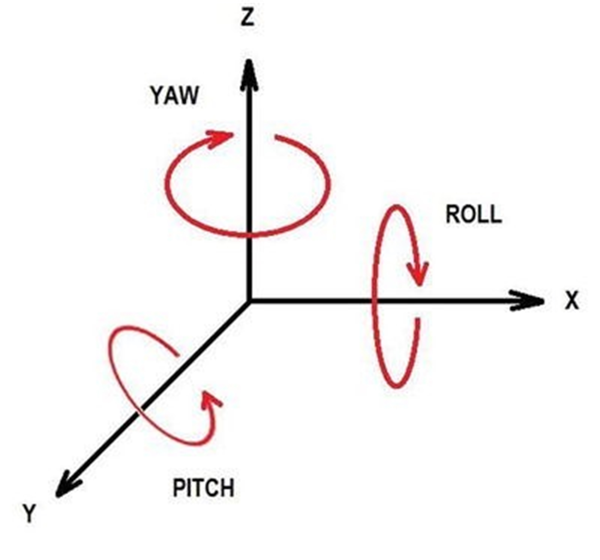

## Robot Peg-in-hole Repository Details

Note: additional more detailed documentation can be found in the /documentation folder as Adobe pdf files.

Software was developed for peg-in-hole experiments that consisted of two
ROS workspaces:

1.  Gazebo pegboard world called gzpegboard,

2.  F/T experiment repository called crpi_test.

**Note for Windows developers, there is a very important caveat in order
for Gazebo to work on a Windows distribution** - the Windows Subsystem
for Linux (WSL) specifically **WSL 1 must be installed for Gazebo to
work**. Note, we found WSL 1 sufficient, while WSL 2 was inoperable. ROS
noetic does not need WSL, however, when we uninstalled WSL we found that
Gazebo no longer worked. There is no mention of this in the Microsoft
distribution of ROS 1 noetic. One final caveat regarding the Microsoft
ROS noetic distribution, Gazebo material, specifically textures, did not
seem to work.

The first ROS workspace handled the Gazebo simulation of the pegboard
world. Figure [\[fg:gzpegboard\]](#fg:gzpegboard){reference-type="ref"
reference="fg:gzpegboard"} shows the Gazebo visualization of the
pegboard world. This includes launching a Gazebo client and a Gazebo
server. The Gazebo server (gzserver) reads the pegboard SDF World file
to generate and populate a world. The Gazebo client (gzclient) connects
to a running gzserver and visualizes the pegboard world. The gzclient is
also a tool which allows you to modify the running simulation.

### Gazebo pegboard world Workspace

The Gazebo simulation of the pegboard world ROS workspace contains a
Windows batch file that uses roslaunch of the Gazebo pegboard world. The
roslaunch tool is the ROS mechanism for launching multiple ROS nodes, as
well as setting parameters. To simplify distribution, we localized all
the Gazebo pegboard SDF world definitions in the gzdatabase folder
contained in the workspace, The gzdatabase folder is similar to the
Gazebo database in that it contains both models and material SDF
definitions.

First we examine the Windows batch file that sets up the Gazebo
environment variables, and start the simulation.
Listing [\[ls:pegboardbat\]](#ls:pegboardbat){reference-type="ref"
reference="ls:pegboardbat"} shows the change to the bin folder under the
gzpegboard workspace and starting the"gzpegboard" batch command file.
Note, there is no catkin required to start the Gazebo pegboard world
simulation, as all the ROS components already exist in the noetic ROS
distribution (roscore, Gazebo client/server).

``` {#ls:pegboardbat label="ls:pegboardbat" caption="Use batch file to start the Gazebo pegboard world"}
> cd bin; gzpegboard.bat     
```

The Gazebo pegboard world uses a batch executable to start the ROS and
Gazebo using a roslaunch. The batch uses all Gazebo environment variable
contained in the workspace (e.g., not global default definitions such as
GAZEBO_MODEL_PATH).

First, we determined the root folder of the Gazebo pegboard world using
a Windows DOS batch script trick. Unfortunately, there are always a
number of tricks with any scripting language, either bash, DOS, or
powershell. Navigating paths using local variables in DOS can be tricky.
Listing [\[findbatchtrick\]](#findbatchtrick){reference-type="ref"
reference="findbatchtrick"} shows the use of the "FOR" DOS command that
allows one to iterate over a list of items and run commands on each of
them. Below is an example to set the "root" local batch variable to the
current directory $(`cd`)$ parent (i.e., "..").

``` {#ls:findbatchtrick label="ls:findbatchtrick" frame="single"}
FOR /f "usebackq tokens=*" %%x IN (`cd`) DO SET root=%%x\..
```

One trick to make this folder navigation easier is to use the
"usebackq", which will remove the double quotes around items with the
'cd' command (but there are none). This is useful if the file path has
spaced in it that need to be double quoted.

Understanding the location of the workspace root folder is unnecessary
to define the Gazebo environment variables.
Listing [\[ls:gzroslaunch\]](#ls:gzroslaunch){reference-type="ref"
reference="ls:gzroslaunch"} shows we first define Windows environment
variables to define the environment variable "aprs" which points to the
Gazebo SDF world file, the Gazebo model folder and then the Gazebo
plugins folder (for our gripper plugin). We then use the Windows "set"
DOS command to define the required Gazebo environment variable
GAZEBO_MODEL_PATH and GAZEBO_PLUGIN_PATH.

``` {#ls:gzroslaunch label="ls:gzroslaunch" caption="Batch file setting Gazebo environment variables for pegboard world"}
:: Define the Gazebo world 
set aprs=%root%\Worlds\aprs-lab.world
set models=%root%\gzdatabase\models
set plugins=%root%\pluginswin

:: Define location of model and plugins. First clear
:: Gazebo environment variables.
set GAZEBO_MODEL_PATH=
set GAZEBO_MODEL_PATH=%models%;%GAZEBO_MODEL_PATH%

set GAZEBO_PLUGIN_PATH=
set GAZEBO_PLUGIN_PATH=%plugins%;%GAZEBO_PLUGIN_PATH%
```

Once we have the Gazebo environment setup, we can then use roslaunch to
start Gazebo pegboard world. roslaunch is a ROS 1 XML script command to
start a ROS master, that is the standard method for starting ROS nodes
and bringing up robots in ROS. To start a Gazebo world, we have defined
a gazebo.launch file under the bin folder in the bin\
launch folder that contains all the necessary parameters to start the
Gazebo pegboard world simulation[^3]. Again we use a Windows DOS script
method to retrieve a folder from a 'cd' which is evaluated (executed) by
the DOS shell before the main command is executed, and the output of
that execution is used by that command.

``` {#ls:gzroslaunch label="ls:gzroslaunch" caption="Using roslaunch to start the Gazebo pegboard world"}
:: assign p environment folder to bin folder
FOR /f "usebackq tokens=*" %%x IN (`cd`) DO SET p=%%x

:: assign q environment folder to bin\launch folder
set q=%p%\launch

:: Now change directory to the launch folder and launch Gazebo
cd %q% 
set myfolder=%q%
roslaunch gazebo.launch 
```

The complete Windows batch script to Launch the Gazebo pegboard world
with Fanuc robot using ROS 1 noetic is shown in
[\[ls:gzallbatch\]](#ls:gzallbatch){reference-type="ref"
reference="ls:gzallbatch"}.

``` {#ls:gzallbatch label="ls:gzallbatch" frame="single"}
:::::::::::::::::::::::::::::
:: Launch a Pegboard world with Fanuc robot
:: Folder naming breakdown
:: root
:: root/p
:: root/p/q
:: p=bin
:: q=bin/launch

:: Define the Gazebo folders 
:: assign root environment folder to parent folder
FOR /f "usebackq tokens=*" %%x IN (`cd`) DO SET root=%%x\..

:: assign p environment folder to bin folder
FOR /f "usebackq tokens=*" %%x IN (`cd`) DO SET p=%%x

:: assign q environment folder to bin\launch folder
set q=%p%\launch

:: assign Gazebo model folder, and plugin location
set models=%root%\gzdatabase\models
set plugins=%root%\pluginswin

:: Gazebo
set aprs=%root%\Worlds\aprs-lab.world
set robot1_urdf=%q%\MotomanSia20d.urdf
set robot2_urdf=%q%\fanuc_lrmate200id.urdf

:: Define Gazebo environment variable folder locations
set GAZEBO_MODEL_PATH=
set GAZEBO_MODEL_PATH=%models%;%GAZEBO_MODEL_PATH%

set GAZEBO_PLUGIN_PATH=
set GAZEBO_PLUGIN_PATH=%plugins%;%GAZEBO_PLUGIN_PATH%


:: Win Gazebo will require a roslaunch
cd %q% 
set myfolder=%q%
roslaunch gazebo.launch 
```

### Experiment F/T ROS Workspace

It appears as if most of build of ROS noetic with Visual C++ 2019 is for
release configuration. Since one would like to provide debug symbols
with a release build, this can be done using the $/DEBUG$ property flag
in catkin_make CMakefile.txt as shown in
Listing [\[ls:catkindebugflag\]](#ls:catkindebugflag){reference-type="ref"
reference="ls:catkindebugflag"}, so you can easier debug a release build
application[^4].

``` {#ls:catkindebugflag label="ls:catkindebugflag" caption="Catkin Property to Build a Visual C++ Executable with Debug Symbols"}
set_property(TARGET ${target} APPEND_STRING PROPERTY LINK_FLAGS " /DEBUG")
```

### Running Robot Peg-in-hole insertion Simulation

This section briefly describes the basics of running peg-in-hole
insertion simulation software. The instructions assume a reasonable
understanding of ROS and Gazebo. Further, we assume you have installed
the Microsoft Windows noetic distribution into following the
instructions found [here](http://wiki.ros.org/Installation/Windows).

In addition, the instructions make the use of Windows Terminal to launch
multiple ROS workspace nodes mandatory.

1.  Install by going to Microsoft Store website and searching for
    Windows Terminal. Install. Open Windows Terminal from Start menu. Go
    to the settings under the down arrow on the top bar.

2.  Create a new types of Windows, click the downward arrow button and
    select "+Add new profile" and add "ROS Noetic" terminal.

3.  Listing [\[ls:noeticwinterm\]](#ls:noeticwinterm){reference-type="ref"
    reference="ls:noeticwinterm"} shows the text to copy into ROS
    command line:

    ``` {#ls:noeticwinterm label="ls:noeticwinterm" caption="Text to enable Visual C++ 2019 and ROS to be used as maketools"}
    C:\Windows\System32\cmd.exe /k "C:\Program Files (x86)\Microsoft Visual Studio\2019\Community\Common7\Tools\VsDevCmd.bat" -arch=amd64 -host_arch=amd64&& set ChocolateyInstall=c:\opt\chocolatey&& c:\opt\ros\noetic\x64\setup.bat
    ```

4.  Helps to change starting directory to C:

5.  Additional Windows Terminal installation instructions found
    [here](https://helpdeskgeek.com/windows-10/how-to-install-use-the-new-windows-10-terminal/).

Using Windows terminal configured for ROS, we can now spawn two
terminals to handle the Gazebo pegboard world workspace node and the
peg-in-hole experiments workspace node.

``` {#ls:term1 label="ls:term1" caption="TERMINAL 1"}
> cd C:\opt\ros\noetic
> git clone git://
> cd C:\opt\ros\noetic\gzpegboard
> cd bin
> gzpegboard.bat
```

``` {#ls:term2 label="ls:term2" caption="TERMINAL 2"}
> cd C:\opt\ros\noetic\crpi_test
> catkin_make
> devel\setup.bat
> rosrun test_gazebo_package test_gazebo_package rosbreak:=0 deadReckoning:=1
```

where the commmand line variable for rosrun are defined as:

``` {#ls:rosbreak label="ls:rosbreak" frame="single"}
rosbreak:=0 ignores a breakpoint in vscode
```

and

``` {#ls:deadReckoning label="ls:deadReckoning" frame="single"}
deadReckoning:=1 performs the dead reckoning peg in hole insertion.
```

## Instructions for using the Gazebo Robot F/T Sensor Plugin

The Fanuc LRMate is an articulated robot of the configuration shown in
Figure [19](#fg:robotconfig){reference-type="ref"
reference="fg:robotconfig"}. The Fanuc LRMate uses a roll-pitch-yaw
wrist configuration as shown in
Figure [20](#fg:rpy){reference-type="ref" reference="fg:rpy"}. A
roll-pitch-yaw wrist is a popular robot configuration in that it
provides full range of orientation of the end effector. Note, various
configurations are possible in achieving the same robot pose, by having
the elbow or shoulder either "up" or "down". In our case study, we
assume a two finger parallel jaw gripper that will grab the pegs. We
also employ a Gazebo force torque sensor plugin that detects and reports
the different forces that are applied on the robot wrist for the 3
geometric axes (X-Y-Z). If a zero or little force is measured that means
no force from a contact or collision is detected in the wrist. The
sensor also detects the torque applied around the 3 different axes.

By providing force/torque measurements, the sensor plugin gives feedback
to the robot which can adapt its motion. For example, if the forces
increase that means the gripper held peg is in contact with the
pegboard. Once the sensor is reporting a sufficient amount of force
torque, the robot can not do a spiral or raster search for the hole. It
is possible for the F/T sensor to measure force on a specific axis other
than the Z axis, but we will assume the peg is moving in downward motion
in the Z axis to initiate contact with the pegboard. once the peg is in
contact with the pegboard the downward motion can stop and a sideways or
spiral motion maintaining a constant force can be performed.

{#fg:robotconfig
width="0.9\\linewidth" height="6cm"}

{#fg:rpy
width="0.9\\linewidth" height="6cm"}

Adding the Gazebo force/torque sensor to joint 6 of the Fanuc robot is
based on the tutorial found here [@gazeboft].

The following modifications described in Listings
[\[ls:fanucurdf\]](#ls:fanucurdf){reference-type="ref"
reference="ls:fanucurdf"} and
[\[ls:fanucplugin\]](#ls:fanucplugin){reference-type="ref"
reference="ls:fanucplugin"} were made to fanuc_lrmate200id.urdf

``` {#ls:fanucurdf label="ls:fanucurdf" caption="Modifying Fanuc URDF Gazebo Reference for Joint 6"}
<gazebo reference="fanuc_joint_6">
    <provideFeedback>true</provideFeedback>
</gazebo>
```

This URDF adds the F/T plugin to joint 6 of the Fanuc robot.

``` {#ls:fanucplugin label="ls:fanucplugin" caption="Adding F/T Sensor to Fanuc URDF Joint 6"}
<gazebo>
    <plugin name="ft_sensor" filename="gazebo_ros_ft_sensor.dll">
        <updateRate>50.0</updateRate>
        <topicName>ft_sensor_topic</topicName>
        <jointName>fanuc_joint_6</jointName>
    </plugin>
</gazebo>
```
