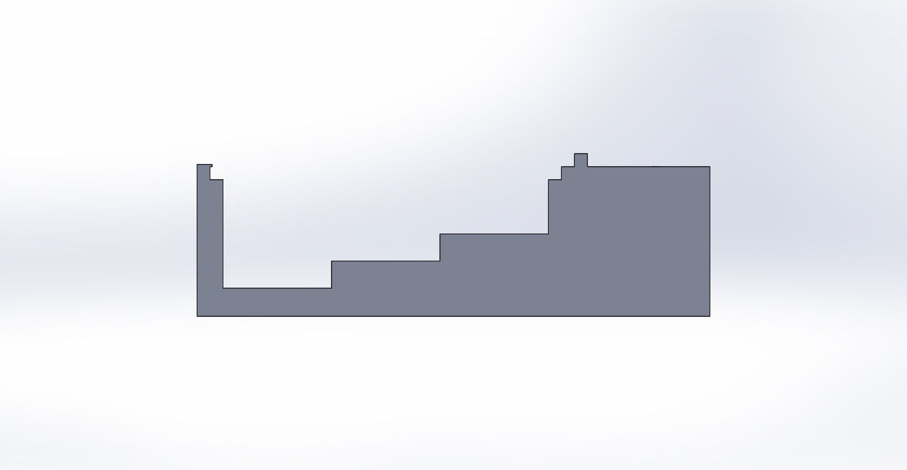
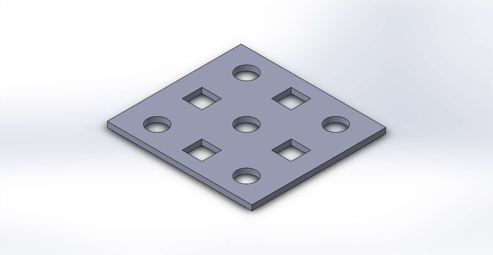
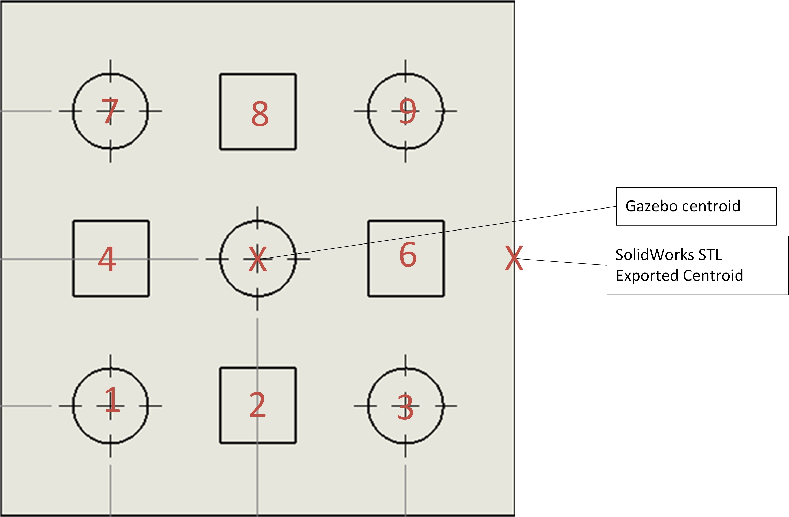
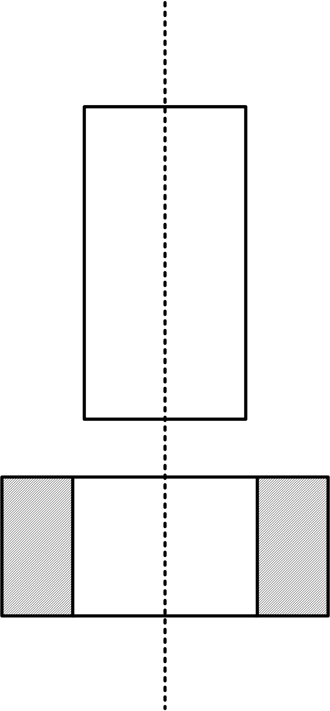
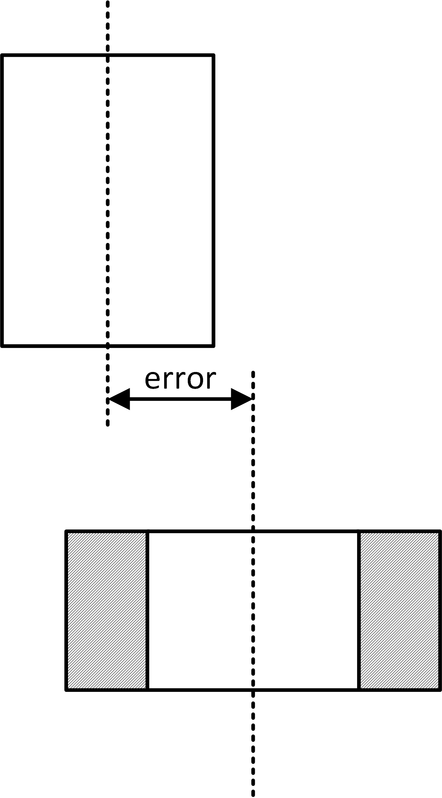
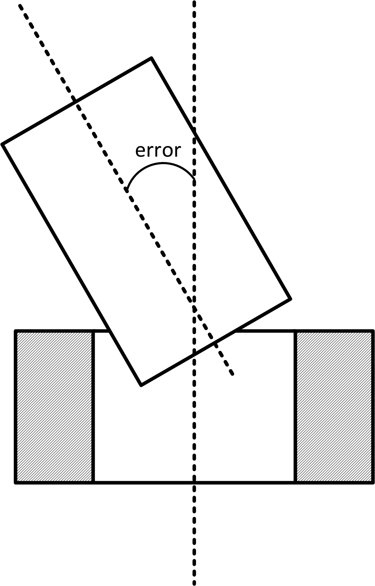
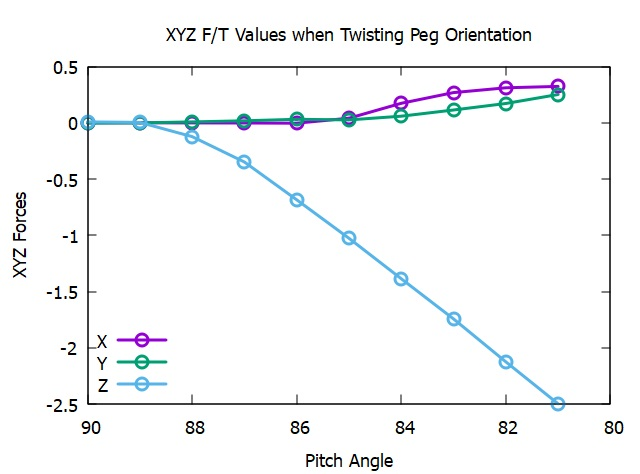
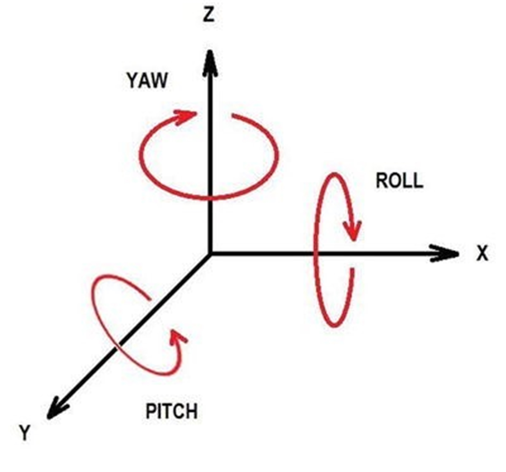

# Simulation of Robotic Assembly Systems with NIST Pegboard Experiments

Kenneth Kimble John Michaloski Craig Schlenoff Joseph Falco\
Intelligent Systems Division\
National Institute of Standards and Technology\
Gaithersburg, MD, USA\
2022-05-18  UTC\

# Executive Summary

In the long run, industrial robot automation is seen as cost-effective
and worthwhile, but the initial capital outlay can be daunting. Robotic
equipment can conservatively[^1] cost \$50K (U.S. Dollars) for a
serviceable 6-axis robot; peripherals, such as a gripper or force/torque
sensor, can cost upwards of \$10K (U.S. Dollars) apiece; then there can
be special utility requirements such as power and pneumatic air to
operate the robot and gripper; and then one must consider allotting for
the space required and potential equipment to meet safety standards. The
expected capital outlay can be considerable, making research and
implementation of a robotic peg-in-hole assembly a costly proposition.

For evaluating a robot assembly operation, realistic simulation could
offer a cost-effective alternative to physically modeling and assessing
the performance of a robot in performing the assembly task. However, it
can depend on the purpose of the simulation - is it to validate the
logistics and understand the performance indicators impacting the
design, or instead is it a physics-based simulation required to learn,
understand, and model a complex manipulation operation. In this paper we
discuss the use of a physics-based simulation to provide valuable
insight into a robotic assembly application as if it were operating in a
dynamical real-world environment. Indeed, considering all the cost and
logistical requirements, a robot simulation offers a promising option
for studying a robot application but only if one assumes a
straightforward, expedient, and accurate simulation.

The peg-in-hole insertion operation is common task in robotic assembly
research. In the real-world, robot positioning of a peg into the hole
presents a formidable challenge due to the uncertainty of the assembly
environment, the inaccuracies of the robot, and possibly the requirement
for very tight tolerances. Clearly, simulation of the real-world
assembly operation is not simple nor straightforward. The advent of
software physics engines allows simulation to actually incorporate
gravity, friction, inertia, collision, and contacts as part of the
simulation world. An accurate physics engine is a mandatory requirement
in a simulated assembly operation since the peg, the hole sides and/or
the support containing the array of holes can come in contact and
require an accurate mathematical description of the forces indicating
the direction of the contact. Without sensor feedback describing the
contacts and forces between peg and various goal surfaces, simulated
robot peg-in-hole assembly with tight tolerances is difficult.

This technical report includes a case study in the use of open-source
simulation and robot control packages to model a peg-in-hole assembly
simulation. The peg-in-hole simulation uses the NIST "pegboard" a CAD
model of pegs (round and square pegs) as well as a platform of
even-spaced holes in which to insert the pegs. The case study uses the
combination of Robot Operating System (ROS), and Gazebo software tools
to simulate robot peg-in-hole assembly. For Gazebo, we used the Open
Dynamics Engine (ODE) physics engine a now antiquated but groundbreaking
model of the physics of the simulated environment. Gazebo also provides
a "plugin" that simulates a force/torque (F/T) sensor between joint 6
and the end-effector which can detect and report contact forces between
the insertion peg and a surface (either the hole side or hole platform).
Using Gazebo to determine the peg forces, the robot adapts motion based
on these simulated F/T sensor readings and offers an exciting learning
opportunity. The simulation uses the existing Agility Performance of
Robotics System (APRS) laboratory Gazebo
simulation [@piliptchak2019physics; @michaloski2021agile] but replaced
the kitting trays with pegboards. The Gazebo simulation world used a
Fanuc robot with a parallel finger gripper, one pegboard to contain pegs
to insert, and another pegboard with empty peg holes that serves as a
destination for the peg insertion.

It must be noted that in general any physics-based simulation will not
suffer from degradation of equipment performance or deformation due to
thermal errors, so a simulation can easily do the peg-in-hole assembly
with dead reckoning every time. National Academy of Sciences held a
workshop on Opportunities, Challenges, and Suggestions on the use of
simulation in robotics which noted that many source of uncertainties are
now only marginally handled in simulation [@choi2021use]. Such issues in
real-world that mar robot operation include friction, impact, contact,
actuator noise, wear and tear, uncertain external loads, complex and
unstructured environments, etc. For simulation to be valuable, the
sources of uncertainty must also be present in the simulated world.

Thus, in order to replicate the difficulty of peg-in-hole assembly,
errors must be modeled to more closely replicate the real-world. For
instance, given a simulated peg-in-hole operation, the explicit random
miss of the hole location and then performing a spiral search to find
the hole by understanding a loss of contact reflected in the F/T sensor
reading is a more realistic approximation to the real-world. Thus, F/T
hole searching algorithms and insertion strategies, coupled with
simulated approach errors, must be studied to effectively evaluate
peg-in-hole simulation.

Overall, the aim of the peg-in-hole research is to use the theoretical
aspects of part mating (e.g. forces, moments, etc.) to develop a
practical simulation that deal with the expected equipment and
algorithms used (e.g. robot, simulation, F/T, controller program etc.).
Included in the report are some detailed procedures that were taken
during development of the simulation case study. For example, all the
Computer Aided Design (CAD) models were exported to Standard
Tessellation Language (STL) for inclusion in Gazebo but had their
centroid modified to exhibit a centered xy position around zero with
minimum Z of zero. \[others: ROS 1 noetic implementation on windows\]

**Keywords**: robots, assembly, peg-in-hole, simulation, force control

# Disclaimer

Commercial equipment and software, many of which are either registered
or trademarked, are identified in order to adequately specify certain
procedures. In no case does such identification imply recommendation or
endorsement by the National Institute of Standards and Technology, nor
does it imply that the materials or equipment identified are necessarily
the best available for the purpose.

# Nomenclature

::: tabbing
**AI**Ārtificial Intelligence\
**API**\
**APRS**\
**CAD**\
**COG**\
**COLLADA**\
**CRCL**\
**CRPI**\
**DARPA**\
**DES**\
**F/T**\
**IA**\
**IEC**\
**IEEE**\
**KDL**\
**KPI**\
**LCPs**\
**MTBF**\
**NASA**\
**NIST**\
**ODE**\
**OROCOS**\
**OSRF**\
**PID**\
**RCS** \
**ROS** \
**ROS-I** \
**SRDF** \
**STL** \
**URI** \
**URDF** \
**WSL** \
:::

# Background

NIST has developed several "taskboard" artifacts that replicate small
part insertion and fastening operations found in
manufacturing [@kimble2020benchmarking].
Figure [\[fg:taskboard\]](#fg:taskboard){reference-type="ref"
reference="fg:taskboard"} shows a representative taskboard,
(disassembled
(Figure [\[fg:tbdisassembled\]](#fg:tbdisassembled){reference-type="ref"
reference="fg:tbdisassembled"}), assembled
(Figure [\[fg:tbassembled\]](#fg:tbassembled){reference-type="ref"
reference="fg:tbassembled"}), and a part list
(Figures [\[fg:partlist1\]](#fg:partlist1){reference-type="ref"
reference="fg:partlist1"}
and [\[fg:partlist2\]](#fg:partlist2){reference-type="ref"
reference="fg:partlist2"}). The taskboard employs various fasteners and
fastening operations used in manufacturing assembly such as push-pin,
threading, snap fitting, and meshing with standard screws, nuts,
washers, gears, electrical connectors, belt drives, and wiring.
Taskboards were designed to support evaluation of robotic assembly and
disassembly operations, thus providing a standardized benchmark for
comparative robot assembly performance evaluation. For example, a
cheaper robot may perform adequately for simple push-pin insertion,
while a more expensive robot may be required to do a connector fitting.
Overall, taskboards help advance the development and deployment of
robotic systems to support assembly operations and provide a performance
measurement mechanism to differentiate capabilities. The NIST taskboard
benchmark tools are used to test and evaluate real-world robot control
systems. In fact, numerous competitions have been held to demonstrate
and measure robot skill at
assembly [@yokokohji2019assembly; @WorldRobotSummit2018; @iros2017].
Interested readers can find additional taskboard guidance and supporting
artifact designs online [@taskboardref].

::: center
:::

::: center
:::

::: center
:::

::: center
:::

Part of the taskboard research has found that the most prevalent
operation in assembly is insertions, accounting for over 35% of all
assembly operations [@nevins1979robot]. Recently, NIST has developed a
CAD model of a "pegboard" that is another taskboard whose primary focus
is to enable, challenge, and measure the simulation of peg-in-hole
insertion. This technical report is interested in insertions,
specifically, simulated force control insertion of a peg-in-hole
assembly using NIST pegboard. An existing base of research can be found
that support peg-in-the hole assembly where the primary goal was to
analyze the force signature resulting from a robot control
implementation. This research studies the peg-in-hole problem where
force characteristics of control algorithms are evaluated along with the
success of the insertion
 [@stolt2012force; @park2014dual; @tang2016autonomous].

Simulation has proven to be valuable for evaluating manufacturing.
Manufacturing shops typically measure performance using key performance
indicators (KPI). Discrete Event Simulation
(DES) [@fishman2001discrete; @kampa2017discrete; @bokrantz2018data] is
often used to model the manufacturing system's behavior and provides an
effective performance analysis tool - either visually, statistically, or
pragmatically. Thus, for example, in a manufacturing transfer line you
can determine KPIs, such as the expected throughput or the station that
is the bottleneck. Of note, if the estimated parameters for the
simulation are flawed, then the simulation will be equally flawed. The
requirement for good data, sound underlying mathematical science, and an
accurate model of the simulated world is paramount to a useful
simulation.

Overall, in simulation as well as the real-world system, the command and
control software is evaluated to see how it responds to the challenges.
These challenges can be continuous (such as a human entering a workzone
and causing a work flow pause until the human is out of the workzone) or
discrete (such as sensing a bad part). Indeed, many of the challenges
are not explicitly problems, but rather system responsibilities that
test the system for its
agility [@downs2017using; @IEEEP2940; @kootbally2018enabling]. Robot
agility is defined as "the ability of a robot system to succeed in an
environment of continuous and unpredictable change by reacting
efficiently and effectively to changing factors" [@downs2021assessing].
Systems that react poorly to agility challenges end up treating the
challenge as a fault or worse, ignore the challenge and render a
catastrophic outcome.

All manufacturing simulation is not exclusively for the measurement and
analysis of shop-floor KPI. There are significant differences in the
types and purposes of manufacturing simulations. We will distinguish
between two simulation purposes for clarification of our research:
logistical and physics-based simulation.

Logistical simulation is commonly used to analyze the shop-floor
workflow behavior between multiple manufacturing stations in order to
predict throughput, bottlenecks, starvation or other process indicators.
These simulated workflows are based on previous observations or new
estimates of system behavior such as Mean Time Between Failure (MTBF),
Estimated Time to Completion, Buffer Size, etc.

Physics-based simulation is an extension to logistical simulation that
exhibits real-world simulated elements. Now, MTBF is not just a
performance simulation statistic, but the embodiment of a real-world
problem. Physics-based simulation creates an ideal proving ground for
developing robot applications that can both identify and correct
mistakes and be verifiable. Physics-based simulation allows
high-fidelity and flexible testing methods that magnify the differences
between models and real-world conditions that may not be apparent in a
focused results-driven real-world robot
experiments [@michael2008experimental]. Further, physics-based
simulation provides a coordinated testing environment well-suited to the
complex interactions between robots, sensors, and world model, and the
effects of asynchronous and distributed execution on sensing and
control.

Today, there are a number of physics-based simulators available and Liu
and Negrut provide a a summary of various simulations tools,
technologies, and specialties [@liu2021role]. Game related entries
include Unity [a](https://unity3d.com)nd Unreal Engine
[.](https://www.unrealengine.com) NVIDIA's GPU implementation is Isaac,
which is offers Virtual world support using Unreal, and embeds PhysX for
physics-based simulation. Finally, Gazebo is an open-source 3D
physics-based simulator that can be used to design a virtual industrial
robot world among other robotic endeavors.

We concentrate on Gazebo because although separate technologies there is
a close integration with ROS.Gazebo is managed by Open Source Robotics
Foundation (OSRF). Likewise, OSRF manages ROS, however the projects are
managed separately and Gazebo is not a "part of" ROS. However, Gazebo
and ROS integrate nicely, and a set of ROS API's known as the
gazebo_ros_api provide users with a standard means to modify and get
information from the simulated world.

In all, Gazebo is an open-source 3D physics-based simulator that can be
used to design a virtual industrial robot world. Gazebo has been used
for several robotics challenges, including the DARPA Robotics
Challenge [@krotkov2017darpa], Virtual RobotX [@dionne2019nps],
ARIAC [@DOWNS2021102113] and Space Robotics
Challenge [@hambuchen2017nasa].

Understandably, simulation versus real-world peg-in-hole assembly have
different programming requirements. Real-world peg-in-hole must work to
solve the application task while accounting for any expected or
unexpected difficulties. In this case, there are random errors and
unexpected challenges in the real-world that may be hard to simulate.
For example, in the real-world equipment wear and thermal expansion
errors can alter the precision of the robot as it attempts to insert the
peg into the hole.

By contrast, a simulation model, such as physics-based one, requires a
workable accurate model of the real-world elements. For example, the
simulation model must account for the robots, sensors, world model,
possible errors, potential challenges as well as the task at hand. For
peg-in-hole insertion, a simulation using a physics-based engine handles
the complex modeling. Now gravity, forces, contact, collision, and other
dynamical physics properties that are inherently part of the real-world
are modeled by the simulation physics engine. To be worthwhile, a
simulation must account for all the aspects that are important to the
real-world application. As mentioned, a dead-reckoning peg-in-hole
insertion is not hard in simulation, but offers minimal value to
validation of a real-world application. Further, often simulation is a
two-step operation - first building the simulation of an error and then
testing the simulated system against the error.

In addition to workflow problems, physics-based simulation will
highlight real operation issues. Given a robot for example, we are
concerned both with the logistical performance indicators of the robot,
as well the physics-based actions of the robot so that motion problems
such as overshoot or collisions can be determined before not after
deployment. For peg-in-the-hole simulation, physics-based modeling is
imperative otherwise the operation can be accomplished with an open-loop
insertion, requiring no feedback for contact, forces or collisions. The
lack of physics modeling simplifies the programming but makes it
infeasible for representing and understanding real-world operation.

In this paper, we investigate physics-based simulation of robot
peg-hole-assembly injecting various errors and exploring various
peg-in-hole search techniques. To understand the peg-in-hole simulation
in operation, a case study using NIST pegboard and Gazebo simulation is
developed. The pegboard and peg-in-hole insertion leverages existing
work from the NIST Agility Performance of Robotics System (APRS)
laboratory. The APRS laboratory contains two industrial robots, a Fanuc
LR-Mate 200iD and a Motoman SIA20F.. Software development relied on the
open-source frameworks Robot Operating System (ROS) and Gazebo for robot
control and simulation. In conjunction with APRS, in-house software
development was leveraged to use existing Gazebo/ROS graphical physics
and sensor based simulation of the in-house APRS agility
lab [@piliptchak2019physics]. We used the Gazebo ODE physics-based
engine to simulate such that the models of the robots, kits, and
environment provide a higher-fidelity approximation to the real-world.

This report is organized as follows. Related Work Peg-in-hole is one of
the most common operations in manufacturing
assembly [@pettinaro1996basic]. However, peg-in-hole, which is extremely
trivial for any human [@6614614], is challenging for a robot. Humans can
easily recognize and orient the position of the assembly parts, and then
mate parts by touch. In the case of robots, sight can be replaced by
vision sensors and touch by force/torque (F/T) sensors. However, this is
far from a simple substitution.

Over the years there has been a significant amount of research into the
robot peg-in-hole assembly operation. In fact, mating a peg into a hole
can be considered as one of the most classic problems in robotics. In
the 1970s Nevins and Whitney [@nevins1979robot] divided programmable
robot assembly research into two research parts: how parts interact or
part-mating sciences, and the union of part-mating processes forming a
system that assembles products.

There is a wealth of robotic assembly strategies, of which these
references are not exhaustive, but rather illustrate the wealth, and
difficulty of the research. A variety of research solutions attempt to
solve the peg-in-hole assembly challenge, such as the
position-controlled assembly, passive compliance and various active
compliance techniques such as force-controlled assembly
 [@whitney1982quasi; @sharma2013intelligent; @chhatpar2003localization; @newman2001interpretation; @7992818].
One of the issues with the peg-in-hole research is the list of
assumptions regarding the assembly task. For example, many research
solutions assume a cylindrical peg and a slightly enlarged cylindrical
hole or chamfered hole. As such, since the research requirements are
often too lax and not amenable to actual production, precision robotic
assembly has become a major research and industrial focus.

In the ideal case, a robot peg-in-hole assembly operation can be
performed based on pure position control if accurate position of the
relevant object (i.e., the hole) is provided and the position control
error of the robot is small. However, difficulties associated with the
inherent robot and object errors make position-control robot assembly
difficult. However, if tolerances are loose, and the manufacturing
process is very precise, robot assembly is attainable and rote
programmable insertion is viable. For example, circuit board chip
assembly is common position control insertion [@marcoux1986putting].
However, in general issues arise from inaccuracies using
position-control insertion with a robot in an imprecise environment.

Whitney [@whitney1982quasi] went on to publish a part-mating approach
with the idea of passive compliance to do the assembly. Trong et
al. [@525556] present a general assembly model to understand dynamic
insertion and the development of passive compliant devices capable of
avoiding wedging and jamming in high speed assembly operation where they
look at different factors influencing the behaviour of assembly
processes such as: gravity, inertia, dry friction, compliance and
insertion speed. Haskiya et al. present a passive compliance mechanism
developed for robotic peg-in-hole assembly operations that can
accommodate positional errors between the mating parts without a chamfer
on either part [@doi:10.1243/0954405981515770].

There are many active areas of research studying the performance of F/T
hardware in active compliance control. Sadun et al. [@sadun2016overview]
highlights a summary of currently related works on active compliant
control by using the force control and the impedance control Active
compliance control was used to improve the stability of multi-fingered
robot hand by the measurement of disturbance with concern related to
location of the contact points [@nakashima2010analysis]. Active
compliance control was studied by utilizing F/T sensor on the fingertips
of the gripper [@jo2011compliance]. Hybrid approach using active
compliance and F/T sensing is found in research that studied robot hand
grasping with a contact-rich fingers placement strategy for typical
small objects such as pens, screwdrivers, cellphones, and
hammers [@kazemi2014human].

Many realistic robot assembly solutions have been researched. Stolt et
al. [@stolt2011force] describes the assembly of an emergency switch
which is snapped into place and detects the end of the operation snap
using force sensing. Kleinmann et al. [@kleinmann1995modular] propose a
sensor-based, three-finger gripper approach that divides the mating
process in three parts: part and hole identification, selection of
correct insertion strategy, and handling insertion by means of five
state classifications: movable, tilted, jammed, attached, and inserted.
Shirinzadeh et al. presented a comprehensive study of robot-based
cylindrical peg-in-hole tasks [@shirinzadeh2011hybrid].

Since peg-in-hole is a classic research topic, research into machine
learning to solve robot assembly tasks offers a challenging problem.
Sharma et al. [@sharma2013intelligent] presented peg insertion research
using a neural network among several intelligent strategies that is
trained to infer the hole center. Beltran-Hernandez et
al. [@beltran2020variable] investigate reinforcement learning-based
method to solve peg-in-hole tasks with hole-position uncertainty.
Schoettler et al. [@schoettler2020deep] consider a variety of difficult
industrial insertion tasks using reinforcement learning with visual
inputs and different natural reward specifications, namely sparse
rewards and goal images.

etchi et al. [@setchi1998three] have suggested a 3D simulation program
for the peg-in-hole insertion process. This approach considers the
insertion process as a sequence of discrete events, and models the
process as a transition from one contact situation to another.

Overall, the relevant literature views peg-in-hole as various
combination of processes:

-   approach, edge crossing, one-point contact, and two-point contact

-   two phases with search phase and insertion phase

-   lowering, displacement, shaking, hole-search, and lifting

# Pegboard Artifact

The intent of the NIST pegboard is to challenge robots to demonstrate
assembly manipulation and reasoning skills. Assembly manipulation is
demonstrated by the insertion of round or square pegs into a
corresponding round or square hole. Reasoning at this basic level
requires that a round peg be inserted into a round hole. This "part
mating"[@nevins1979robot] reasoning can range in sophistication. Peg and
hole part mating can range from a dynamically sensor-based analysis of
the assembly scene to a hard-coded data model of the entire pegboard
world. Since physics-based simulation is the goal, the demonstration of
peg insertion of a known peg type and location into a known peg hole
type and location is sufficiently challenging as a starting point. As
part of the research, we explore the use of simulated force/torque based
sensing and its effect on motion control. Even insertion of a peg into a
hole with known insertion types and hole locations can be challenging.

Historically, tolerances for the NIST taskboard given closely-assembled
parts have been made looser than what might typically be used in an
industrial assembly application. This is on purpose. These tolerances
were chosen in order to facilitate difficult benchmarking tasks that
pushed robot performance without being impossible or impractical to
perform given current technological capabilities.

By contrast, the research in this report is about understanding the
capabilities and limitations of simulation to handle robot peg-in-hole
assembly by understanding the interaction of motion control and
simulated F/T sensors. Using the pegboard as an assembly artifact, we
investigate simulated variations on position, and active compliance
using force sensing peg-in-hole strategies. Further, to effect more
realistic simulation, we explore interesting peg-in-hole anomalies, such
as deliberately missing the peg hole and then using a series of F/T hole
seeking search algorithms to find the hole.

Sensing is vital to robot assembly. Sensors can be used to monitor and
control the process, to provide a some adaptability for programmed
deviations, and to improve motion control of the robot. Further, sensing
can provide flexibility through the ability to perceive different parts,
part mating types (e.g., hole, fitting) and can enable more flexible
assembly of different part mating. For our research purposes, we assume
simulation of the peg-in-hole insertion without simulated vision sensing
to derive many of the pegboard object properties. Instead we focus on
the role of the F/T sensor in the simulation. We will assume the
simulation engine will dynamically supply the name and current pose of
all uniquely defined objects, but not subfeatures of these objects. We
call this a virtual sensor because it supplies the basic object
knowledge that would require complex sensor fusion so instead we use the
simulation engine dynamic world model knowledge. Further, although
important dynamic pegboard knowledge will be supplied by a virtual
sensor, much static knowledge will be explicitly modeled by the
software. This is especially true in regard to subfeatures of an object.
Static pegboard design factors include size, shape, hole location, and
type of pegs and board arrays. It should be noted, that many of these
object features (such as hole location) could be determined using the
virtual sensor (i.e., the simulation world model), but often with
significant programming difficulty that is not in scope of the main goal
of the research, which is to simulate force-based peg-in-hole insertion.

## Pegboard CAD Models

Figure [1](#fg:1BinPegboards){reference-type="ref"
reference="fg:1BinPegboards"} shows the Solid Works single pegboard
design, which consists of five round and five square pegs, one pegboard
, and one pegboard . Each pegboard object is designed in Solid Works and
then exported as STL for use in Gazebo. The pegboards contain a grid of
holes with alternating round or square holes. Under the hole grid, are
tiered rows that successively climbs like steps in a staircase. As pegs
are stored in the tiered holes, the grasping area of the peg top
increases as the tiers underneath climb.

::: center
{#fg:1BinPegboards}
:::

::: center
{#fg:2BinPegboards}
:::

{#fg:basearray}

{#fg:pegarray}

{#fg:squarepeg}

{#fg:roundpeg}

The pegboards can be combined to have more complicated reasoning
challenges. Figure [2](#fg:2BinPegboards){reference-type="ref"
reference="fg:2BinPegboards"} shows a Solid Works visualization of a
stacked pair of NIST pegboards. The stacked pegboards form a $90^\circ$
angle between the "flat" and "upright" pegboards. The stacked pegboard
setup presents obstructed access to some of the lower row of pegs on the
upright pegboard. Thus, some advanced reasoning about collision
avoidance and peg accessibility would be involved in unloading and
loading pegs in stacked pegboards.

For clarity, we will illustrate and name each object that is part of the
pegboard CAD models. Note, we use the term array to distinguish it from
board and any confusiong with pegboard. A single pegboard consists of
the following:

-   \- Figure [3](#fg:basearray){reference-type="ref"
    reference="fg:basearray"} shows the base array with rising tiers
    that has groove for holding a peg array.

-   \- Figure [4](#fg:pegarray){reference-type="ref"
    reference="fg:pegarray"} is the array that contains the round and
    square holes from which hole subfeature offsets are computed. A
     fits on top of the slots of a .

-    - Figure [5](#fg:squarepeg){reference-type="ref"
    reference="fg:squarepeg"} is the  with flat beveled ends.

-    - Figure [6](#fg:roundpeg){reference-type="ref"
    reference="fg:roundpeg"} is the  with flat beveled ends.

A few design and simulation observations are in order.

1.  The pegs have a chamfer on the ends that helps center the peg within
    the hole during insertion experiments. However, the pegboard does
    not incorporate a chamfer along the rim of the hole. In general, a
    chamfer makes insertion in the real-world simpler as the chamfer
    "guides" the peg into the hole.

2.  Assembly tolerances are an important consideration in peg-in-hole
    assembly. Tolerance is specified in the manufacturing process based
    part geometry, material type, and other specifications. Since
    tolerance in manufacturing is critical both for product quality,
    expected performance, and manufacturing cost, simulation should be
    verified by various tolerances - both tight and looser. Since
    changing the widths of the pegs is not difficult and can be done
    with a scale transformation, tolerances can be easily adjusted for
    different peg-in-hole experiments.

3.  Orientation challenges are minimized as the mating of the round and
    square pegs to round and square holes requires no or minimal peg
    reorienting. Clearly part mating of complex shape geometries may be
    more difficult but are out of scope.

4.  The pegboard pegs require no special grasping technology, and we use
    a two finger parallel gripper. Further, we assume a centered
    grasping the peg, and no additional reasoning concerning where to
    grasp on the object, how much force to apply to grasp, or any speed
    requirements when moving the pegs.

## Pegboard CAD object models in Gazebo STL

The CAD simulation pegboard models do not necessarily have an equivalent
representation of an object. For the simulated Gazebo world used,
objects are expected to supply either an STL or COLLAborative Design
Activity (COLLADA) [@opencolladal] visualization mesh file, inertial
frame, and a collision shape typically matching the visualisation. Other
Gazebo model properties are possible to define but were not addressed in
this simulation.

The pegboard objects model outlined above are more formally defined in
the Gazebo model database [@sdfmodedbl] using SDF (Simulation
Description Format). SDF is an XML format that describes Gazebo models
and environments for robot simulations, visualization, and
control [@sdfmakemodel]. An SDF model embeds a top-level \<model\> SDF
tag, and is essentially a collection of links, joints, collision
objects, visuals, and plugins. The \<visual\> XML element is used to
visualize parts of a link. A link may contain 0 or more visual elements.
The \<collision\> XML element encapsulates a geometry that is used for
link collision checking. The \<inertial\> element describes the dynamic
properties of the link, such as mass and rotational inertia matrix. A
\<joint\> connects two links -- one a parent and the other a child link
-- along with other parameters such as axis of rotation, and joint
limits.

Gazebo is best programmed and understood using a standardized centroid
that has a Cartesian xy value that is midpoint of the length/width
values and a Cartesian z value that is at the bottom of the object so
that it sits flat on a surface when placed in a Gazebo world. Thus, the
first modeling requirement for Gazebo simulation using the NIST pegboard
objects derived from Solid Works is for all exported STL to have a
standardized centroid for placement in Gazebo world.
Figure [\[fg:spacecentroid\]](#fg:spacecentroid){reference-type="ref"
reference="fg:spacecentroid"} shows how the object, in this case a cube,
is centered about the xyz axes, with the minimum z is 0.0, which is also
the centroid Z value.

$$\begin{array}{c@{\quad}l}
\scriptstyle where&\\
\scriptstyle &0=x_{max}-x_{min} \\
\scriptstyle &0=y_{max}-y_{min}\\
\scriptstyle &0=z_{min}\\

\end{array}$$

For example, to satisfy the
Figure [\[fg:spacecentroid\]](#fg:spacecentroid){reference-type="ref"
reference="fg:spacecentroid"} Gazebo centroid, the STL for the pegboards
will need to be reoriented so that the xyz centroid now has xy centered
around the origin, while the Z centroid is at the bottom of the array
and sits flush on the robot table.
Figure [7](#fg:centroid){reference-type="ref" reference="fg:centroid"}
shows the Gazebo xy centroid of the as compared to the Solid Works xy
centroid.

In order to normalize the STL file to the Gazebo centroid, there are
many software tools that are available for transforming the STL centroid
into a Gazebo centroid [@cignoni2011meshlab; @riegel2016freecad]. Over
time many sophisticated CAD and Mesh Analysis tools have emerged, but a
simple command line Python programming mechanism was preferred as it
simplifies the learning experience. Further, the more complicated CAD
tools used a proprietary Python backend to program the transformations.

The existing Python module "stl-mesh" was wrapped in a
"TransformStlMesh", which is a command line application that provides
STL whole file transformations. TransformStlMesh uses "stl-mesh" to
provide a set of common STL mesh transformation functions, including
rotation, translation, scaling and axis centering of the STL. When the
STL mesh transformations are completed, the code automatically generates
a new file name with "\_Centered" or "\_ZeroZmin" or "\_ZeroZmax" or
"\_Rotate" axes appended to original file name. For pegboard objects,
TransformStlMesh was used to center xy and translate the mesh so that
the minimum z is zero. TransformStlMesh also generates an STL mesh
analysis report containing volume, Center of Gravity (COG), Inertial
Frame, and min/max xyz.

::: center
{#fg:centroid}
:::

Since the hole layout reasoning is tied to the CAD model layout and not
to sensor reasoning, a hole's type and location must be defined. Hole
locations on the pegboard are defined relative to the center hole.
Fortuitously, the center hole has as its center the pegboard . The hole
offsets are defined regardless of the orientation of the pegboard .
Thus, to determine any given hole position, it is derived as an offset
from the center of the pegboard and center hole location. Each hole and
type is an offset from this centroid, as Gazebo model reports the
centroid of features, so we must calculate the centroid of each hole
subfeature based on its offset from the pegboard centroid.

Basic transform math can be use to generate a hole location (the
Cartesian xyz of its pose) given the hole pegboard centroid consisting
of its Cartesian location, and orientation given as a quaternion. Note,
Gazebo uses the quaternion to represent rotation in a pose. Given the
hole pegboard centroid as a pose, it is converted into a 4x4 Homogeneous
Matrix representation, that is then multiplied by the $i^{th}$ hole xyz
offset to derive the hole Cartesian position.

$\begin{array}{rl}
    P_{pegarray}&=gazebo\_getcurrent\_pose(pegarray)\\
    T_{W}^{pb}&=Convert(Pose_{pegarray})\\
    Hole_{i}&=T_{W}^{pb} \times 
    \left[
\begin{array}{cccc}
1 & 0 & 0 & xoffset_{i} \\
0 & 1 & 0 &yoffset_{i}  \\
0 & 0 & 1 & zoffset_{i} \\
0 & 0 & 0 & 1
\end{array}\right]\\
where: &\\
P_{pegarray}& the\ centroid\ pose\ of\ the\ pegarray\\
gazebo\_getcurrent\_pose&Gazebo\ ROS\ model\ plugin\ to\ get\ current\ position\ and\ orientation\ of\ pegarray.\\
Convert()&  function\ converting\ from\ Pose\ to\ Homogeneous\ Matrix\\
T_{W}^{pb}& defines\ a\ Transform\ from\ world\ to\ hole\ pegarray\ centroid\\
Hole_{i}& defines\ transform\ Cartesian\ position\ of\ hole_{i}\\
\end{array}$

Table [\[tb:holeoffsets\]](#tb:holeoffsets){reference-type="ref"
reference="tb:holeoffsets"} shows the pegboard  of hole offsets. Hole 5
row is grayed and is equivalent to the centroid of the hole pegboard.
Given the  pegboard centroid, this table can then used to compute the
centroid of any hole. The shaded row is hole 5, which has a (0,0,0) xyz
offset from the centroid, so its xyz centroid matches the centroid of
the . For the other 8 holes, each has xyz offset from the pegboard
(0,0,0) centroid which is added to the actual hole pegboard centroid to
determine the hole xyz centroid. All holes are even spaced in a 3x3
table with holes 1,4,5 on the highest z first step height, holes 2,5,8
on the second step z height, and holes 3, 6,9 on the lowest z third step
height. Note, all offset values are in meters, the length units of
Gazebo.

::: tabularx
.80\|\>=.2L\|\>=.12R\|\>=.12R\|\>=.12R\|\>=.12R\|\>=.12R\|\>=.12R\|
HOLE& X offset& Y offset& Z offset& X centroid& Y centroid &Z centroid\
 centroid&&& &-0.09888& -0.5891 &0.9351\
- round & 0.0508 & -0.0508 &0.0143 & -0.04808 &-0.6399 & 0.9494\
- square& 0.0508 & 0 & 0& -0.04808 &-0.5891& 0.9351\
- round & 0.0508& 0.0508 &-0.0129 &-0.04808 &-0.5383& 0.9222\
- square& 0 & -0.0508 &0.0143 & -0.09888 &-0.6399& 0.9494\
5 round& 0 & 0& 0 & -0.09888 &-0.5891& 0.9351\
- square& 0.0508 & 0 &-0.0129& -0.04808 &-0.5383& 0.9222\
- round&-0.0508 & -0.0508 &0.0143 & -0.14968& -0.6399& 0.9494\
- square& -0.0508 & 0 & 0 & -0.14968 &-0.5891& 0.9351\
- round & -0.0508& 0.0508& -0.0129 & -0.14968& -0.5383& 0.9222\
:::

s mentioned, the Solid Works STL export is normalized to Gazebo standard
centroid format. This normalization process was done to all the pegboard
objects so that any Solid Works STL object is first centered around the
(0,0,0) and then translated so the the minimum Z is zero. Finally, all
the pegboard objects were scaled by a factor of 0.002 so they are in
Gazebo length units (meters) as well as a reasonable size for robot
manipulation.

Listing [\[ls:roundpegsdf\]](#ls:roundpegsdf){reference-type="ref"
reference="ls:roundpegsdf"} gives the SDF model listing for a  found in
the Gazebo model database. The SDF tag \<model\> with name attribute
"pegboard-roundpeg" contains XML elements that define the
pegboard-roundpeg. The model is given as a collection of links, joints,
collision objects, visuals, and plugins. (For brevity, the collision
bounding box is omitted below.) We will go over some of the highlights
of the SDF model definition.

``` {#ls:roundpegsdf .xml label="ls:roundpegsdf" language="XML" caption="Round Peg Gazebo Model SDF Listing"}
<?xml version="1.0" encoding="UTF-8"?>
<sdf version="1.6">
   <model name="pegboard-roundpeg">
      <static>1</static>
      <link name="link1">
         <pose frame="">0 0 0 0 0 0</pose>
         <collision name="collision1">
         . . .
         </collision>
         <visual name="visual1">
            <pose frame="">0 0 0 0 0 0</pose>
            <geometry>
               <mesh>
                  <scale>0.002 0.002 0.002</scale>
                  <uri>model://pegboard-roundpeg/pegboard_round_peg-1_Centered_ZeroZmin.stl</uri>
               </mesh>
            </geometry>
            <material>
               <script>
                  <name>Gazebo/Purple</name>
                  <uri>__default__</uri>
               </script>
            </material>
         </visual>
         <inertial>
            <mass>0.0385</mass>
            <inertia>
               <ixx>4.78233711e+00</ixx>
               <ixy>2.06443170e-09</ixy>
               <ixz>3.14256508e-00</ixz>
               <iyy>4.78233728e+00</iyy>
               <iyz>1.83990112e-08</iyz>
               <izz>2.44284722e-01</izz>
            </inertia>
         </inertial>
         <self_collide>0</self_collide>
         <gravity>0</gravity>
      </link>
   </model>
</sdf>
```

The pegs and all pegboard related CAD models were designed in Solid
Works and exported as STL files. These STL file provide the visual
element to a model and are located by using a Uniform Resource
Identifier (i.e., \<uri\>) in the Gazebo model as shown in
Listing [\[ls:urifile\]](#ls:urifile){reference-type="ref"
reference="ls:urifile"}. Each pegboard related object (i.e., , , round
peg, and square peg) are defined in the Gazebo model database. These
exported STL files serve as the image visualization for the \<visual\>
element of Gazebo SDF.

``` {#ls:urifile .xml label="ls:urifile" language="XML" caption="STL Visual Mesh File Definition for {\\sc{round peg}}\\ Gazebo"}
<uri>model://pegboard-roundpeg/pegboard_round_peg-1_Centered_ZeroZmin.stl</uri>
```

Gazebo uses a "world" SDF file to define the simulation and it contains
a collection of robots and objects (such as tables, pegboards, and
pegs), and global parameters including the sky, ambient light, and
physics properties. For the pegboard world, we define five round pegs
(i.e., pegs 1,3,5,7,9) in our Gazebo world, all using the same
"pegboard-roundpeg" model but each having a different name and pose
(position and orientation) to distinguish between the definitions.
Listing [\[ls:worldfile\]](#ls:worldfile){reference-type="ref"
reference="ls:worldfile"} shows two of the five round peg definitions
but each has a different pose (position and orientation).

``` {#ls:worldfile .xml label="ls:worldfile" language="XML" caption="STL Visual Mesh File Definition for {\\sc{round peg}}\\ Gazebo"}
<model name="fanuctaskfeeder_peg1">
         <include>
            <uri>model://pegboard-roundpeg</uri>
         </include>
         <pose frame="peg1">-0.04808 -0.6399 0.9494 0 0 0</pose>
      </model>
. . . <--! round pegs 3,5,7 are omitted for brevity -->
      <model name="fanuctaskfeeder_peg9">
         <include>
            <uri>model://pegboard-roundpeg</uri>
         </include>
         <pose frame="peg9"> -0.14968 -0.5383 0.9222 0 0 0</pose>
      </model>
```

The \<include\> SDF element informs Gazebo what model to use from the
database to define each fanuctaskfeeder_peg#. The \<pose\> SDF element
defines the pegs in world coordinate frame as a pose defined as (xyz,
rpy) in the Gazebo simulation scene. Note, the difference in the
 Cartesian z pose values, which is due to the tiered steps in the .

Scale is a ratio that represents the relationship between the dimensions
of a model and the corresponding dimensions on the actual figure or
object. In Gazebo, it helps in representing a model as either a larger
or smaller model with comparative ease.
Listing [\[ls:scalesdf\]](#ls:scalesdf){reference-type="ref"
reference="ls:scalesdf"} contains a mesh STL  model definition, that is
scaled by 0.002. The value 0.002 is first a conversion from millimeter
STL units to Gazebo meter units (scaling by 0.001 factor) and then
doubling the size of the converted STL model. Note, the holes in the
pegboard hole array are a "fixed" diameter that depends on the scale of
the pegboard, as it is difficult to individually scale subfeatures in
STL. Likewise, all the pegboard objects have been scaled by the same
value (i.e., 0.002).

``` {#ls:scalesdf .xml label="ls:scalesdf" language="XML" caption="Scaling Factor applied to {\\sc{round peg}}\\ Gazebo SDF"}
<mesh>
   <scale>0.002 0.002 0.002</scale>
   <uri>model://pegboard-roundpeg/pegboard_round_peg-1_Centered_ZeroZmin.stl</uri>
</mesh>
```

There is a benefit to simulating the pegs as it is easy to alter the
diameter of the peg by a scaling factor. Thus, during experimentation,
pegs can be scaled to be smaller than the hole diameter, near exact fit
to the hole diameter size, or larger than the hole diameter. The scaling
factor should be uniform across objects, that is, either half as small,
a quarter smaller, etc. in order to maintain a proper peg and hole fit.
However, it is possible to marginally adjust the scale of the pegs to
simply insertion of the peg into the hole or even make it impossible to
fit.

Note, scaling of the pegs reduces or increases the diameter, but also
scales the length of the peg, which effects total kinematic chain length
involved in computing from the robot base, links, end-effector to the
end of grasped peg object. Further, the location on the peg where the
robot grasps the peg also changes the total length the robot kinematic
chain. Because of the use of F/T sensing, once the peg is in the hole,
the peg can be lowered until a F/T threshold is reached and the downward
motion can be stopped.

Since the physics mass properties of the pegboard object can effect the
simulation, the properties for mass and inertia are part of the SDF
model definition. The inertia tensor encodes the mass distribution of a
body, so it does depends not only on the mass, but also on how the mass
is distributed through the object body. To get the  mass, a weight
measurement scale was used. For the inertial vector, the
TransformStlMesh provided an the inertial matrix as part of the log
output as shown in
Listing [\[ls:inertia\]](#ls:inertia){reference-type="ref"
reference="ls:inertia"}. From experience, it is important to give model
and its links an inertia matrix that is at least close to the correct
order of magnitude. Otherwise, the simulation will be flawed, with parts
floating, flying, and other unrealistic behaviors.

``` {#ls:inertia .xml label="ls:inertia" language="XML" caption="Physical Properties of the {\\sc{round peg}}\\ STL Mesh"}
[pegboard_round_peg-1_Centered_ZeroZmin]
Path=C:/Users/michalos/Documents/bin/Python/PyTransformStlMeshes/STL/Reoriented/pegboard_round_peg-1_Centered_ZeroZmin.stl
Volume = 6342.806604544011
Position of the center of gravity (COG) = [ 3.10002108e-06 -3.65554342e-07  2.54000009e+01]
Inertia matrix as expressed at the COG
 [ 1.40279411e+06 -9.07309563e-03  1.35811663e-03]
 [-9.07309563e-03  1.40279411e+06  2.65794256e-03]
 [1.35811663e-03 2.65794256e-03 1.26325800e+05]
Cartesian object bounds
x= (-6.328197479248047, 6.3282012939453125)
y= (-6.3282012939453125, 6.3282012939453125)
z= (0.0, 50.80000305175781)
```

# Simulated Peg-In-Hole Case Study

Simulation can contribute to the cost-effective performance evaluation
of robot assembly. But, there are aspects that limit the role that
simulation plays today in intelligent robot design. For instance,
simulation that is just a graphical visualization of the robot sequence
of operations is insufficient for replicating real-world physics
behavior. Instead, rigid-body physics-based simulation, where the
physics of the robots, objects, and environment are modeled provides a
higher fidelity approximation to the real-world. For example, the
inserting of a peg into a hole in visual simulation could incorrectly
overlay two images at the bottom of the slot (the  and ) without
consequence. However, in the case of physics based simulation, the
 would "bounce" off the  as it is physically impossible for a solid
object to atomically combine with another solid object.

In our case study, we are more concerned with establishing a
high-fidelity simulation of a robot peg-in-hole assembly using active
F/T sensing for which various experiments can be performed. The NIST
pegboard is well-suited for simulating the robot peg-in-hole operation,
which is an essential task in assembly processes for manufacturing.
Figure [8](#fg:2Pegboards){reference-type="ref"
reference="fg:2Pegboards"} shows the simulation setup using the NIST
pegboard as both a container of pegs as well as pegboard of holes to
insert the pegs. Note, the pegboard supplier and the pegboard
destination are both single pegboards with no attached backboard . In
the front, the pegboard contains pegs to insert, while the pegboard in
the back of the figure contains empty peg holes that serve as a
destination for the peg insertion.

::: center
{#fg:2Pegboards}
:::

In peg-in-hole simulation, a purely dead reckoning approach to inserting
the peg in the hole is possible, since simulation does not inherently
have errors. For example, in the real-world wear and thermal expansion
errors could alter the precision of the robot as it attempts to insert
the peg into the hole. Such errors could lead to an off-center
theoretical-to-real hole target, resulting in a crash into the pegboard.
For this reason, often simulations inject noise to make the simulations
more "realistic". Although dead reckoning appears to be an easy solution
in simulation, one of the issues associated with making precise
simulated robot moves is determining the exact length of all the links
-- especially the gripper. Any error in the kinematic modeling of the
robot results in errors in robot positioning. For this reason,
established robot kinematic models and visualisation were used and are a
match for the actual robots, however, the simulated gripper was
generated from a Schunk gripper model, which was not the actual gripper
of the robot in the APRS laboratory. Hence, substitution and
experimentation of different robots, end-effectors, or device
configuration is easily possible using simulation.

Another distinguishing element in regards to a simulation peg-in-hole
implementation concerns the various levels of robot command and control.
At a high level, the command would be \"peg-in-hole\" and it is expected
a lower level command structure would perform command and control of the
assembly operation. At a high level, command and control has an
expectation that the command will succeed and is actually more concerned
with understanding error recovery. For example, what would a high-level
robot command and control module do in the case of a dropped peg, or an
impossible insertion scenario where there is misfit between peg and
hole. Recovery from such errors is then a primary goal of higher-level
reasoning. This level of reasoning is beyond the scope of this case
study. At a lower level, there is an implicit F/T sensing performance
requirement in a real-world robot assembly operation. One can expect
force feedback to be approximately 1KHz bandwidth in order to be
effective. Otherwise, trajectory motion must be slowed so that force
feedback latencies do not result in undue delays which can result in the
robot crashing because it cannot stop in a timely manner. Thus, you
often see a tight coupling between the robot actuator control and the
force sensor feedback in order to reduce latencies and achieve smooth,
efficient motion control. Various performance metrics of a simulated F/T
sensor, such as stiffness, compliance, or noise, are not dealt with in
case study experiments. Further, we assume the F/T sensor is located in
a traditional site, attached to the robot wrist. Du et al. provide a
survey of strategies for implementing a wrist-based solution to dynamic
assembly [@Du1999].

We will use a software architecture to describe the structural software
components and relationships of the case study. For peg-in-hole
assembly, the software architecture of the implemented system adapted
for the simulation case study is shown in
Figure [\[fg:pegarch\]](#fg:pegarch){reference-type="ref"
reference="fg:pegarch"}.

As background, the National Institute of Standards and Technology has
conducted ongoing research on improving robot "agility" to adapt to
changes in environment, tasks, and robots, and handle both spontaneous
and unexpected task deviations. As part of the effort, the Agility
Performance of Robotics System (APRS) laboratory has been constructed to
further evaluate agility research under real hardware conditions. To
further the dissemination of the agility research, NIST has produced a
physics-based simulation of the in-house APRS agility lab incorporating
ROS and Gazebo [@aksu2018virtual; @michaloski2021agile]. The peg-in-hole
case study experiments are based on the APRS laboratory at NIST, which
contains two industrial robots, a Fanuc LR-Mate 200iD and a Motoman
SIA20F but replaced the kitting trays with pegboards. For the case study
experiments, the Gazebo simulation world used a Fanuc robot with a
parallel finger gripper, one pegboard to contain pegs to insert, and
another pegboard with empty peg holes that serves as a destination for
the peg insertion.

## Gazebo

Gazebo is open source software, with simulated physics, robots and
sensors, and near real-time performance running complex scenarios. These
simulation features allow software development that performs nearly
identically in simulation as on real hardware, thereby increasing
productivity and code quality [@aguero2015inside]. Gazebo has the
flexibility to switch between physics engines, but we used the default
including Bullet [@bullet] Open Dynamics Engine
(ODE) [@erez2015simulation]. ODE is an open source physics engines that
supports simulation of rigid body dynamics using a C/C++ API. Gazebo
simulates articulated rigid body structures, such as robots, which are
created when rigid bodies of various shapes are connected together with
joints of various kinds.

Gazebo uses an XML format called Simulation Description Format (SDF) to
represent the world. SDF is used to define a simulation "world"
containing robots, sensors, static and dynamic objects, lighting,
terrain, physics. Moreover, plugins can be added to SDF for further
refinement of robot simulation, control, and visualization. Since APRS
is robot-centric the ability to model robots and their properties was a
critical element. SDF contains robot descriptors for visualization,
collision, physical properties, and robot control.

The pegboard simulation required simulating all the objects in the
Gazebo world. This included the robots, gripper, pegs, and pegboards
that are part of the peg-in-hole assembly application as well as the
furniture, tables, and other objects in the APRS lab. We used the Gazebo
preexisting library of models for tables, chairs, computers, monitors
that were used. Also, a CAD model of the agility lab layout existed as
part of the APRS simulation and was incorporated into the Gazebo world
model. The next step was integrating the pegboard models into the Gazebo
SDF World. Using the Solid Works pegboard CAD models, all the pegboard
objects were exported as STL meshes and normalized to Gazebo units and
centroid requirement.

The Fanuc robot was modeled using preexisting ROS URDF
definitions [@rosifanuc]. Note, URDF is geared to describing robots,
while SDF can describe a robot, the world, or any model in the world.
However, the gazebo_ros_api was used to load the Fanuc robot URDF into
Gazebo which required augmenting the URDF and XACRO files for the
pegboard robots by adding some Gazebo URDF extensions (e.g., inertia,
gazebo colors, etc.). Then the robots URDF models underwent were loaded
by roslaunch using the gazebo_ros_api plugin.

The gripper was based on Schunk CAD models which were imported into
Solid Works and then exported to URDF. The Solid Works to URDF exporter
is a Solid Works add-in that will create a ROS package that contains a
directory for meshes, textures and URDF files.

Plugins are a way to extend and add to Gazebo simulation functionality.
With plugins, a programmer writes a modular piece of software with an a
wealth of Gazebo and ROS API to access robotic and simulation
functionality as opposed to digging into (or worse changing) the code
base.A Gazebo plugin is a piece of C++ code that is compiled as a shared
library and inserted into the simulation world SDF model. The plugin has
direct access to all the functionality of Gazebo through the standard
C++ classes. Gazebo plugins are useful for the following reasons: 1)
allow access to any part of the Gazebo system, 2) are modular and
self-contained, and 3) can be inserted and removed from a running
system. Gazebo itself relies on software component technology, notably
plugins, SDF to describe the world models, and existing gazeb_ros_api
plugins to integrate ROS and Gazebo. All simulation extensions to Gazebo
were done with plugins. The gripper grasping plugin was a customized
plugin, while others (i.e., model plugin and joint update) were
gazebo_ros_api off-the-shelf plugins.

## ROS

The Robot Operating System (ROS) is an open source software framework
that provides libraries and tools to help programmers create robot
control systems and applications. The primary goal of ROS is to enable
software developers to build robot applications quickly and easily on a
common platform. The following elements of ROS were used within pegboard
case study.

-   **ROS core** is a collection of nodes and programs that are
    pre-requisites of a ROS-based system.The ROS core aggregate the
    packages required to use publish/subscribe, services, launch files,
    and other core ROS concepts.

-   **ROS communication** is based on message passing between a set of
    ROS nodes. The communication messages are organized by topics which
    follow a publisher/subscriber pattern. Topics are either predefined
    or customized and includes messages for commonly used command and
    control, for example commanding or feedback of robot joints.

-   **ROS services** are used to perform either asynchronous or
    syncrhonous request/reply communication with a remote procedure
    calls.

-   **ROS param** is a parameter server that provides much of the
    configuration information for a ROS1 application. The ROS param is
    part of the ROS master that can be used for individual parameters
    (param), or in bulk through a YAML configuration file (rosparam).

-   **tf library** was used for robot pose data modeling. ROS tf defines
    data types for: Quaternion, Vector, Point, Pose, Transform. Of note,
    CRCL data types were mapped into ROS tf data types.

-   **Unified Robot Description Format (URDF)** was used to model robot
    link and joint relationships. Each robot in the APRS simulation
    provided its own URDF file. Existing ROS libraries (specifically
    URDFdom) can parse URDF and were used to standardize and simplify
    the extraction of kinematic parameters.

-   **Semantic Robot Description Format (SRDF)** complement the URDF and
    specifies joint groups, default robot configurations, additional
    collision checking information, and additional transforms that may
    be needed to completely specify the robot's pose. As recommended,
    the case study generated SRDF using the MoveIt Setup
    Assistant [@srdftutorial].

-   **Packages** are used to govern ROS development with code added to
    ROS by creating a new package. Packages can contain anything:
    libraries, nodes, message definitions, or tools. Above packages are
    the concept of a stack, which collects sets of packages that
    together provide useful functionality [@cousins2010sharing].

-   **Gazebo/ROS Model Plugins** are part of the Gazebo_ros package,
    which has many ROS utilities and plugins that work with Gazebo.
    Often, Gazebo has a plugin that is encapsulated or improved by ROS.
    In addition, communication with gazebo_ros uses ROS topics, not
    Gazebo topics so it uses the ROS tool chain. Gazebo_ros was used to
    obtain the Gazebo object models current world pose. Thus, the
    centroid pose for peg, which is the (x,y,min z) Cartesian location
    and orientation, is attained using this plugin.

-   **MoveIt!** is a set of software packages integrated with the Robot
    Operating System (ROS) that has numerous capabilities, mostly geared
    for autonomous navigation, but does provide the ability to execute
    robot Cartesian motion plans. Since Moveit! is a bit overkill for
    kinematic and Cartesian motion planning, we integrated Open Robot
    Control Software (OROCOS) [@orocos] Kinematics and Dynamics Library
    (KDL) to provide forward and reverse kinematics, as well as
    trajectory and joint motion planning. Fortunately, KDL is integrated
    into ROS and supplies a URDF parser that we used to build the KDL
    robot kinematic chains. We used the KDL motion planning as at this
    point, we did not expect any obstacles, so were not concerned with
    collisions and obstacle avoidance, which is a strength of Moveit!
    trajectory level motion planning.

## Grasping

The peg-in-hole assembly robot application relies on grippers and
grasping for the manipulation of pegs. Because of its practical
importance, grasp planning has been extensively investigated. The reader
is referred
to [@bicchi2000robotic; @ferrari1992planning; @murray2017mathematical]
for a general introduction on grasping. Recent grasping work can be
found in [@leon2010opengrasp]. We relied on typical grasping that
required the use of open/close two finger grippers. The grasping
operation itself is a simple scenario, the robot centers the gripper
around the peg and then closes to grasp the peg. The emphasis of the
physics based grasping simulation is close/carry/open two-finger gripper
control. As simple as this scenario appears, there is real-time
simulation factor, friction, collision computational loading that
effects the gripper responsiveness, which is mathematically intense due
to complexity in collision handling.

In the real-world APRS lab, the robots perform grasping using pneumatic
parallel grippers. A typical ROS approach for defining parallel grippers
in software involves mimic joints, where one joint "mimics" a second
joint by maintaining its relative position and velocity in joint-space.
Mimic joints are passive joints that linearly mimic the motion of
independent active joint in a kinematic loop. Use of mimic joints are a
common method to synchronize the symmetric closure of a parallel
gripper. However, physics-based simulation of gripper actuation lack
"mimic" joints, so operation the resulting finger positions would not be
symmetric. Because of this, a popular ad-hoc approach is to use external
control plugins [@mimicplugin] which implement a
proportional-integral-derivative (PID) force controller that uses the
mimic joint's relative joint position as the feedback term. However,
there are problems with using such a control scheme for parallel
grasping such as the lack of a guarantee that the gripper's fingers will
remain symmetric throughout a trajectory especially if they experience
different external forces. To remedy many of these shortcomings, we used
the Gazebo APRS grasping plugin developed at NIST by
Piliptchak [@piliptchak2019physics].

The APRS grasping plugin was designed to handle many small objects. This
introduces two challenges to physics-based simulation. The first
challenge is simulation stability. The stacking of objects, especially
objects with large inertia-ratios, is known to cause instability due to
over-constraining the linear complementarity problems (LCPs) that are
solved by the physics engine at each time step [@smith_ode]. The second
challenge is compute speed, which deteriorates as the number of contacts
to simulate increases. To improve both stability and computational
performance, the Gazebo APRS grasping plugin automatically simplifies
contacts between relatively stationary objects. The Gazebo APRS grasping
plugin offers an improvement over previous dynamics-disabling features
found in Gazebo's primary physics engine, which only applied to
absolutely stationary objects [@smith_ode]. It is also fairly physics
engine-agnostic and lightweight, provided the physics engine supports
measuring constraint forces and dynamically spawning joints.

Overall, rigid-body physics engines are adept at tackling specific
simulation problem areas, such as numerically stable contacts and joint
articulations [@brugali_extending_2014; @todorov_mujoco:_2012; @physx].
However, a significant amount of effort needs to be put into defining
contact behavior, inertia matrices, friction coefficients, and numerical
solver parameters to ensure acceptable performance [@smith_ode]. This
effort becomes increasingly laborious as the simulated environment
becomes more complex.

The Gazebo APRS grasping plugin is loaded into the Fanuc world as a
Gazebo plugin and listens for ROS Service command requests. The APRS
grasping plugin uses a ROS workspace to define both the ROS Service
topic and the Gazebo plugin code both required to encapsulate an
open/close Service command. The APRS grasping plugin Service invocation
can be synchronous (i.e., returns when grasp has completed) or
asynchronous (i.e., returns when Service command received), but
asynchronous has proven to provide more robust behavior.

## CRPI

The Collaborative Robot Programming Interface (CRPI) software is
intended to provide an architecture to support the metrology of
collaborative robot performance by means of commanding a myriad of robot
platforms simultaneously with a singular command structure [@crpi]. CRPI
was developed to be an instantiation of the conceptualized model of the
Canonical Robot Command Language (CRCL) messaging language to
communicate with the robots [@crcl_rosi; @Proctor16]. CRPI itself is an
API client-server architecture. CRPI is the client API interface with
numerous objects and function calls that connects to a robot which acts
as a server then fulfills. CRPI has many extensions beyond CRCL based on
satisfying real-world application requirements. As such, CRPI contains
additional software functionality to address peg-in-hole programming
requirements. Specifically, CRPI includes peg-in-hole micromotions that
were developed to do "real-world" peg-in-hole assembly demonstrations in
2015.

CRPI is intended to provide a composable robot system by using a uniform
robot Application Programming Interface (API) type definitions and
declarations that serves as the front-end to command a myriad of
back-end robot platforms. CRPI uses a C++ or Python API as a programming
front-end with the back-end expressly coded using the proprietary robot
socket or serial communication stream. CRPI uses the trajectory and
joint planning of the underlying robot for motion control. Since we were
using a Gazebo robot simulation which does not provide these services,
we used linear and spherical interpolation between goal and way points
as this was sufficient for simulation and the most expedient.

Of most interest from CRPI was its peg-in-hole micromotion hole
searching strategies. Hole search is generally done by locating the hole
center using a vision-sensor or by using blind search techniques. For
our F/T case study experiments, we assume a blind search. CRPI defines a
collection of implemented blind hole search assembly primitives,
including:

-   **Random** uses a random walk to determine hole location. The random
    search is defined by the radius of the search region and includes a
    flag for determining whether to allow the search to explore beyond
    the radius.

-   **Spiral** uses a spiral motion from the center where contact was
    detected expanding outward until either the hole is detected or the
    location of the search area limit has been reached. The spiral
    search is defined by clearance between peg and hole in mm, the
    distance between turnings. and the radius of the search region. Lans
    et al. have an in depth discussion on spiral motion [@lans2019peg].

-   **Square Spiral** uses a rectangular spiral motion from the center
    where contact was detected expanding outward until either the hole
    is detected or the location of the search area limit has been
    reached. The square spiral search is defined by the search step size
    and the search radius.

-   **Raster** uses a rectangular side-to-side pattern from top-bottom
    or left to right starting at the outward boundary where contact was
    detected tracing side-to-side in a rectangular pattern until either
    the hole is detected or the location of the search area limit has
    been reached. The raster search is defined by the number of rasters
    to create in the search area, the width of the search area and the
    length of the search area.

-   **Hop** adds a hopping element to the search with a magnitude
    defining maximum displacement from the current position and the
    frequency the rate at which the tool tip center is moved up and
    down.

-   **Rotation** uses a rotational search (rotating the part back and
    forth along the Z axis) given the range is defined as the maximum
    rotational offset and the speed defines the speed at which the part
    is rotated.

-   **Circle** uses a circular search (moving the tool center point in a
    circle) to the queue, given a radius of the circle pattern.

-   **Linear** uses a linear search to the queue, whereby at boundary
    condition the robot hops to the adjoining search location. The
    linear search is defined by an x offset for the X axis distance
    offset, a y offset for the Y axis distance offset, and a z offset
    for the Z axis distance offset.

-   **Constant offset** adds a constant distance terminator condition as
    defined by an x offset for the X axis distance threshold, a y offset
    for the Y axis distance threshold, and a z offset for the Z axis
    distance threshold.

These search strategies employ a variety of micromotions that should
only require a centimeter$^{2}$ maximum in search area and that is also
achievable in a relatively short time frame. Otherwise, the use of a
camera to narrow the searching area would be necessary to make the
implementation practical. In general, search strategies are evaluated in
terms of execution time, precision, stability, and applicable geometries
and features of parts. Jiang et al. provide a classification of state of
the art in search strategies [@JIANG2022100259].

For case study experiments, since CRPI is primarily a Microsoft Visual
C++ Studio front-end, it did not seamlessly build with Microsoft ROS
Noetic Visual C++ 2019. Instead, peg-in-hole related portions of CRPI
were ported to build with Microsoft C++ 2019 and ROS catkin_make.

# Peg-In-Hole Experiments

A great deal of research of the robotic peg-in hole assembly operation
has evolved over the past decades. In the real-world, peg-in-hole
assembly makes the assumption that the system is heavily influenced by
uncertainties coming from mechanical, sensor, and control errors. In
order for a simulated peg-in-hole to be valuable, it must understand and
replicate these real-world uncertainties. At worst, a simulation may not
understand how or why errors occur, but should be able to offer a
reasonable approximation to the error and cause the errant behavior.
Further, there is a wealth of research concentrated on real-world
peg-in-hole error detection and error recovery strategies offering a
multiplicity of different issues and solutions. The simulated
peg-in-hole task description and accompanying experiments are presented
with an emphasis to validate what is achievable, reliable, and
consistent in reproducing real-world challenges. We start with a general
peg-in-hole model and offer some experiments that explore the simulated
model. These experiments are by no means mathematically rigorous or
scientifically complete, but establish that F/T sensing of peg-in-hole
is possible in Gazebo and provide a glimpse into the possibilities of
using a simulation rigid-body physics engine equipped with a F/T sensor.

Foremost, we will attempt to classify the multitude of peg-in-hole
algorithms. The majority of research is either in support of a new
passive insertion technique, or new sensor enabled active compliance
technique. Most if not all solutions are in support of a overcoming an
imperfect world, where the peg undergoes some real-world challenge
before mating with the hole. The initial focus of peg-in-hole analysis
of algorithms will be on understanding the issues that arise while
inserting the peg, and then classify the responses based on the error.
Often there is no "correct" solution and instead a solution based on the
application or circumstance is preferred.

Of note, potential solutions are more broadly applicable than one might
find in our domain of interest, manufacturing. For example, let us
assume we have an android personal assistant robot with a key in hand
ready to open a door in the dark, and then have to use a tactile based
search for the keyhole with the key in order to insert the key, unlock
the door, to then open the door. Such confluence of challenging
occurrences would not typically be found in a structured manufacturing
environment, but at a micro-level of operation may be necessary to
smartly "wiggle" a key into a hole. It is the subtle adaptive behavior
that humans routinely exhibit, but robots struggle with.

Our case study uses a Gazebo simulated Fanuc robot to act as a test
platform to explore many elements such as F/T feasibility, hole
searching algorithms, contact forces, and peg insertion strategies. The
research is by no means complete but establishes that open-source
physics-based F/T simulation is possible and that many opportunities
await.

## Peg-In-Hole Task Description

The peg-in-hole case study task description is summarized as follows. A
disassembled pegboard starts with a series of nine peg holes (both round
and square), and an assembled pegboard of identical layout but
containing pegs. Initially, the allotted pegs were limited to round
pegs, which provided better spacing between pegs to insure easier
clearance for the robotic gripper to grasp pegs. Thus, we assume all
pegs are vertically held by a pegboard with easy grasping access for our
gripper. There are a cacophony of issues related to developing a
peg-in-hole insertion model of operation. One area not covered concerns
aligning the pegs shape to match the hole shape when presented in
different orientations. We assume part mating is geometrically matched.
The two major issues we will address in peg-in-hole assembly are one's
arising from a small error in lateral or angular misalignment that
require remedial action to enable the insertion.
Figure [10](#fg:LateralError){reference-type="ref"
reference="fg:LateralError"} shows an error in the peg location relative
to hole, while figure [11](#fg:AngularError){reference-type="ref"
reference="fg:AngularError"} shows the misorientation of the peg
relative to the hole. Otherwise jamming could occur and cause damage to
the assembly robot and or the mating parts.

::: center
{#fg:DeadReckoning}
:::

::: center
{#fg:LateralError}
:::

::: center
{#fg:AngularError}
:::

Figure [9](#fg:DeadReckoning){reference-type="ref"
reference="fg:DeadReckoning"} shows a part mating with no or little
misalignment. Dead reckoning can offer possible strategies for dealing
with minor misalignments. Analogous to a human wiggling a peg into a
hole, a robot could impart minor random "wiggling" in a lateral
back-forth direction, which simultaneously imparting a small downward
force until the robot detects that the peg is positioned in the hole.
There is a fine line between wiggling and "jamming" the peg into the
hole that could cause damage to the robot and or the mating parts.
Chamfered holes and/or pegs provide further compensation to the dead
reckoning to make part mating even more likely. Du et
al. [@du1999assembly] found it is often desirable to introduce
small-amplitude random vibration or dithering during parts mating to
overcome stiction. Dead reckoning compensated insertion should be
expeditious and predictable or a timeout would be necessary. NIST CRPI
framwork has search functions that are also applicable to effect various
dither/wiggling micromotions [@crpigit].

Figure [10](#fg:LateralError){reference-type="ref"
reference="fg:LateralError"} shows a part mating lateral error, we
assume the peg will be approach the hole but instead of "perfect"
insertion path, the robot F/T sensor will detect contact between the peg
and the surface. So, when the robot has achieved an approximate location
of the hole and at the same time detects an increase in the F/T due to
contact, we can assume that a lateral misalignment has occurred and we
must now "search" for the hole. For our case study experiments, we apply
the CRPI search algorithms to find the hole center to enable insertion.

Figure [11](#fg:AngularError){reference-type="ref"
reference="fg:AngularError"} shows an angular peg error, where the
tolerance between the peg and the hole plays a significant part in
assessing a remedial action. Depending on the circumstances, we may find
a peg off-center in the hole that needs to centered, a peg that is
skewed in orientation compared to the hole that must be aligned to the
insertion vector of the hole, a relaxed grip to allow the peg to wobble
"back/forth" into the hole, a micro-spiral in order to find a lower
contact F/T relationship between the peg and the hole, among other
potential remedial actions.

## Study of F/T Sensor during contact in attempting Peg-In-Hole

This section discusses some active compliance tests using the Gazebo F/T
plugin situated at the wrist of the Fanuc LR Mate. We run some tests to
validate the functionality of the F/T plugin, as well as uncover some
weaknesses in our software base.

Figure [12](#fg:FTPegArray){reference-type="ref"
reference="fg:FTPegArray"} shows a graph of F/T Z-axis values as the
robot approaches the hole in a completely vertical descent in the Z
axis. The Z F/T values are essentially zero, until the peg makes contact
with the hole array surface. The experiment runs the robot into the hole
array surface (purposely missing the hole) until the F/T Newton force Z
value \> 0.05N and then stops. If you examine the visualization of the
robot Z axis descent, you can notice a push-back by the hole array
surface to the peg, indicating that the stopping contact force is too
large.

::: center
{#fg:FTPegArray}
:::

::: center
{#fg:gzftvisualization}
:::

As for the repeatability, the F/T Z values were close enough, but there
is currently much latency between approaching position to the hole array
surface, due to poor responsiveness of Gazebo to service command. A
lower level Gazebo guarded move plugin with much higher responsiveness
was coded but not successful deployed after many attempts. The Gazebo
guarded move plugin was coded to command the robot to initiate motion in
a certain direction while monitoring F/T value that would trigger a stop
motion, when, for example, a Z F/T value exceeded a force threshold,

ne of the more interesting research aspects that must be considered when
using robot assembly simulation is the variability of the physics engine
to perform as expected. When combined with programmer error, this can
lead to flawed expectations. For example, a peg should drop to the
bottom of its hole but given friction, stiction, or worse possibly a
software glitch the peg may not rest in the final centroid position.
Having observed this behavior one can anticipate some problems. Thus,
observing and persevering through these idiosyncrasies merits a warning
that rigid-body physics engines are a rather new and enabling force for
simulating complex physical realities but are not foolproof. As these
rigid-body physics engines mature (as well as inherent computational
power), many of these problems will disappear.

The initial replication of the force based contact experiment did not
yield the results one would expect, and in fact, they differed due to a
variety of issues. One issue was the difference in expected top-of-peg
height that was different between runs - the initial SDF world model and
a later reinserting the peg into its original pegboard hole. However,
using an initial run of the contact-peg-forces experiment did result in
highly replicated results with minor differences in F/T simulated sensor
readings.

Peg-In-Hole Dead Reckoning Algorithm The dead reckoning Peg-In-Hole
algorithm, which assumes ultra-precise robot motion, and no
imperfections in the pegboards, follows. First, the robot must select a
peg from the supply pegboard. Next, the robot grasps the selected peg in
a hole slot. Then, the robot vertically retracts upward away from the
supply pegboard slot. Once retracted, the robot traverses to a position
directly overhead of the matching assembly pegboard hole type. Once
situated above the hole, the robot vertically lowers the peg into the
hole, releases its grasp of the peg, and then retracts from the peg. The
robot speed of simulated dead-reckoning peg-in-hole is unimportant,
except for the closing grasp operation on the peg, which has some
contact latencies that need to trigger before there is an actual
"virtual grasp".

There can be difficulty when using dead reckoning insertion for
insertion objects and hole shapes that are misoriented, for example, a
rectangle that is aligned lengthwise instead of width-wise. For this
misoriented situation, the insertion object centroid and the hole
centroid must be in alignment, and then the insertion object must
reoriented to match the hole shape without any lateral Cartesian
movement of the insertion object. Using a robot to reorient its
end-effector is commonplace for robots with an articulated wrist. An
additional challenge is possible if the hole is askew and not aligned
along a primary axis. Li et al. [@li2021robotic] discuss use of robotic
assembly for irregular shaped Peg-in-Hole. Given the relative ease to
modify the pegboard CAD design, it is possible to increase the
complexity of the shape and forms of the pegs and holes.

In spite of the ease of peg insertion, the dead-reckoning approach
offers opportunities for exploring F/T response in various
circumstances. One experiment is to alter the orientation of the peg
once inserted in the hole to understand the F/T reading simulated sensor
reading under a known state. Another experiment is to alter the
orientation while retracting and grasping the peg to understand the
forces in reverse.

::: center
:::

Figure [14](#fg:PegDeadReckoning){reference-type="ref"
reference="fg:PegDeadReckoning"} shows the setup after a peg has been
inserted into a hole using dead reckoning.
Figure [15](#fg:AfterTwist){reference-type="ref"
reference="fg:AfterTwist"} shows the final test peg orientation in the
hole after 10 negative degree increments. The orientation starts with a
90$^{o}$ pitch orientation in the hole and
Figure [15](#fg:AfterTwist){reference-type="ref"
reference="fg:AfterTwist"} givens the final pitch orientation as
80$^{o}$ . If one looks closely at the hole in
Figure [16](#fg:TwistGap){reference-type="ref" reference="fg:TwistGap"},
there is a gap between hole boundary and the peg, which could be related
to the increased size of the hole to the peg based on the tolerance, or
some other possible simulation issue.

::: center
{#fg:PegDeadReckoning}
:::

::: center
{#fg:AfterTwist}
:::

::: center
{#fg:TwistGap}
:::

Figure [17](#fg:tiltedpegforces){reference-type="ref"
reference="fg:tiltedpegforces"} shows the F/T readins during the
experiment to test tilting the peg pitch orientation while already in
the hole. As expected the XYZ forces increase, with the Z F/T value
exhibiting the largest increase in a negative direction.

The Z force indicates a negative force as the pitch twist angle deviates
from perpendicular, so it acts in a negative direction based on the
coordinate system.

::: center
{#fg:tiltedpegforces}
:::

## Study of Hole Searching F/T

A most critical technical bottleneck to robot assembly is to find the
best search strategy to improve positioning accuracy in assembling.
Jiang et al. [@JIANG2022100259] present a review of the state of the art
of search strategies and identify ways to improve existing algorithms.

In general, search strategies are evaluated in terms of executing time,
precision, stability, and applicable geometries and features of parts.

One of the issues involved in developing a peg-in-hole algorithm,

In the force sensor based peg in hole assembly search strategy, the
search path is pre-set in the search algorithm, and a threshold value is
set for the force/torque (F/T) generated during the peg and hole
contact, and the feedback control of the F/T sensor is used to achieve
the peg-in-hole assembly search task when the assembly robot is unable
to meet the accuracy of autonomous assembly due to large errors during
positioning and repetition.

Ongoing research at NIST has developed and applied the Collaborative
Robot Programming Interface (CRPI) software library to various robot and
gripper ability, dexterity and collaborative tasks. CRPI areas related
to our research included robot peg-in-hole as well as robot assembly.
CRPI explored numerous search and insertion strategies that will serve
as a starting point in understanding our peg-in-hole research.

1.  First, the robot grasps the peg and positions the end effector in
    either an upright or at an angle.

2.  Next, while the robot is grasping the peg it moves toward the hole,
    until contact is detected which corresponds to an increase in the
    F/T sensing. The rate of the robot approach to the hole/surface
    depends on the latency of the F/T feedback reporting. Smaller
    latencies mean faster detection of surface and faster stopping of
    searching motion. Even with small latencies, the robot motion cannot
    be excessively fast, of it will still crash into the surface.

3.  Upon detected contact with the surface, the robot now starts to
    search for the hole maintaining contact with the surface and using a
    micromotion planner to move the robot grasped peg. Upon a change in
    the detected F/T feedback it is assumed the peg is now in contact
    with the hole and switches to an insertion strategy.

We have two basic hole searching algorithms: spiral and raster. The
spiral algorithm is a common approach to hole finding that uses an
increasing circular path upon each rotation around its initial surface
contact point. Park et al. [@park2020compliant] discuss a compliant
peg-in-hole assembly method based on blind searching using a spiral
force trajectory.

The raster algorithm is another common approach to hole finding. The
raster micromotion planner sweeps back and forth across the surface
until it detects a change in F/T indicating lower contact because of the
hole. The raster uses the contact point as the center of the raster and
then uses a fixed width and height to start an expanding rectangle
raster search. A different approach could use a "top" to "bottom" search
covering one row at a time.

Wiggling Peg-In-Hole Insertion Algorithms The goal of this experiment is
to perform a simulated wiggling of a peg into a hole. This wiggling
procedure is important for peg and hole tolerance that are nearly
identical, and the peg could become "stuck" while inserting the peg. In
order to test a wiggle using the existing NIST pegboard dimensions, one
would be required to enlarge a peg to almost an identical size as the
hole. This can be achieved in Gazebo by increasing the peg STL scale
multiplier until just fits in the hole.

Algorithm [\[alg:wiggle\]](#alg:wiggle){reference-type="ref"
reference="alg:wiggle"} describes the steps in wiggling a tightly
tolerance peg into a hole. Lans and Lillqvist use a modern compliant
commercial robot to describe an algorithmic approach to wiggling a peg
into a hole [@lans2019peg]. As mentioned, often the tolerance between
the peg and the hole can be very tight leading to jamming. Using a
constant downward force while attempting random tilting micro-motions
with the peg could overcome jamming. Minor reorienting of the tool tip
to prevent jamming and to effect wiggling is not done in the same way as
moving the tool tip in a predefined trajectory. The x, y and
z-coordinates needs to be static while the orientation has to be
manipulated based on the forces recorded on the peg.

::: algorithm
::: algorithmic
assume missing hole target slightly \< 0.002 m assume slight
misorientation downward force in Z direction random wiggle in xy
orientation direction monitor forces to detect decreasing force
[]{#roy's loop label="roy's loop"}
:::
:::

ooser tolerances between the peg and the hole can have a more In this
case, the wiggling consists of deliberately changing the direction of
peg insertion by rotating a peg about both the insertion axis and its
tip. The algorithm describing it may be outlined as follows:

-   tilt peg with respect to the surface of the hole,

-   repeat

-   push peg inside hole,

-   rotate peg anti-clockwise slightly about the hole axis

So far only the algorithmic approaches have been developed that would be
used in simulating a "jammed" peg being inserted into a hole - either a
very tight tolerance or a looser tolerance. In the real world, one could
record teach robot positions for grasping the peg, the location of the
top of the hole and then program a wiggle. To simulate properly, one
must model the kinematic chain to the top of the hole in a pegarray. For
these tests we want the top of the hole in which to place the peg, which
requires a more complete model of the pegboard and especially the peg
array. In defining the pegboard model containing the pegs the Gazebo SDF
has been defined using world coordinates (in the Gazebo world).

``` {#ls:pegboardmodel label="ls:pegboardmodel" caption="Gazebo Reporting of Current Peg Model Names and Locations"}
sku_taskfeeder_base_fanuc1=  0.183, -1.053,  0.916,0.000,-0.000,90.000
sku_taskfeeder_pegarray_fanuc1=  0.219, -1.054,  0.991,0.000,-0.000,90.000
sku_fanuctaskfeeder_peg1=  0.270, -1.105,  0.931,0.000,-0.000,0.000
sku_fanuctaskfeeder_peg3=  0.270, -1.003,  0.931,0.000,-0.000,0.000
sku_fanuctaskfeeder_peg5=  0.219, -1.054,  0.942,0.000,-0.000,0.000
sku_fanuctaskfeeder_peg7=  0.168, -1.105,  0.954,0.000,-0.000,0.000
sku_fanuctaskfeeder_peg9=  0.168, -1.003,  0.954,0.000,-0.000,0.000
sku_taskfeeder_base_fanuc2=  0.183, -1.303,  0.916,0.000,-0.000,90.000
sku_taskfeeder_pegarray_fanuc2=  0.219, -1.304,  0.991,0.000,-0.000,90.000
```

Summary Peg-In-Hole F/T Insertion Algorithms

Search is generally done by locating the hole center using a
vision-sensor or by using blind search techniques.

1.  Grasping: First, a peg in the pegboard is is grasped with the two
    finger finger as indicated. One could argue that the experiment
    would be more robust if the peg was in various orientations, either
    upright, sideways, etc. However, we assume a peg standing upright in
    the pegboard with a centroid returned by the Gazebo simulation/ From
    the centroid and the length of the peg, we can determine the
    location on the peg where to grasp the peg. The Gazebo grasp plugin
    uses a physics-based approach mechanism based on closing forces
    which center the gripper around the peg shaft as it closes.

2.  Approach: Depending on the insertion strategy, either the peg is
    grasped upright or the peg is grasped slightly tilted, approximately
    20 degrees from vertical.

    For a slightly tilted peg it allows for a peg-in-hole insertion with
    sufficient angle for first detecting one side hole force contact and
    then a two sides in the hole force contact.

3.  Approach: In the approaching phase, the angle distance relation
    shows that users tilts the peg in its approach in a rather
    systematic way.

4.  Insertion: The insertion phase is guided by the occurrence of a
    sideways force that aids the human in maintaining a correct position
    of the peg relative to the hole. This particular force-event is
    recognizable prior to the angle-alignment between the peg and hole,
    in particular for the peg with a tight fit due to the increased
    necessity for a proper alignment.

Peg-In-Hole assembly has been the benchmark force-controlled robotic
assembly. It involves two main stages. The first one aims at placing the
peg center within the clearance region of the hole center, known as the
search phase. The next step is to correct the orientational
misalignment, known as the insertion phase. The insertion has been
widely researched as compared to the search phase. Search is generally
done by locating the hole center using a vision-sensor or by using blind
search techniques [@sharma2013intelligent].

::: center
{#fg:alignmentphase
width="50%"}
:::

Much of the research literature studies the peg-in-hole insertion
assuming a peg tilt and then a centering "wobble"[^2] while descending
into the hole. We wish to observe the forces seen when contacting one
hole side, and then both hole sides. In either case, an upright in-place
gripper orientation should find the peg in the hole center. Experiments
were run to test the hypothesis.

In the robot all-zero joint position, the Fanuc LR Mate robot is in the
home position as shown in Figure xxx. This produces a home Cartesian
pose yyy. In order to achieve a downward pointing gripper to allow the
peg to be picked up, we rotate the along the Y axis (pitch) for 90
degrees, (i.e., \[0.000000,90.000000,0.000000\]). This gives us a
resulting quaternion of (0 0.707107 0 0.707107).

Many of the research teams use a tilted peg, so we also studied the
measured simulated forces when a $20^{o}$ angle approach to hole was
used.

One method to tilt the peg is to rotate along the Y axis (pitch) an
additional 20 degrees, (i.e., \[0.000000,110.000000,0.000000\]) giving
us a resulting quaternion of (0.000000,0.819152,0.000000,0.573576).
Another method to tilt the peg is to rotate along the X axis (roll)
$-20^{o}$, while maintaining a $90^{o}$ (i.e., \[-20., 90.0, 0\]) giving
us a resulting quaternion of (-0.122788,0.696364,0.122788,0.696364).

## Challenges using Gazebo and Simulation when Implementing Peg-In-Hole Algorithm

Currently the major impediment to accurate simulation is the lack of
accurate complete models and accompanying routines. For example, even
though Gazebo can supply a bounding box of the peg, giving a the top
location of the model, the routine has not be integrated into
peg-in-hole code base. Further, subfeatures, such as holes require the
feature offsets from the centroid to be explicitly modeled, and
unfortunately, the STL dimensions are unit-less on purpose.

inevitably requirement to implement and understand all workspace
objects. For example, using SDF can give you the

where you grasp an object

partial models - for example, what is the difference between the lower
centroid Z and the upper Z in the hole peg array. STL only reports a
unitless numeric range that did not directly map into a concrete number.
For example, the Z height of the hole peg array was 88.5 but no units.

# DISCUSSION

Simulations are invaluable tools in developing industrial robotic
systems. In situations where hardware resources are limited or costly to
use, simulations can provide a test-bench for developing controllers,
debugging software, and testing various work-space configurations
[@NIST_ARIAC].

Robotic peg-in-hole assembly is a very complex dynamic process. A
complete analysis of the geometric and dynamic equilibrium conditions
has established a general assembly model for a certain goal: to
understand the mechanism of dynamic insertion and the development of
compliant devices capable of avoiding wedging and jamming in high speed
assembly operation [@525556]. One of the limiting factors to using a
simulation in place of a real system is how well it replicates the
physical dynamics of the real system. This discrepancy has inspired the
development of new rigid-body physics engines that tackle specific
problem areas, such as numerically stable contacts and joint
articulations [@brugali_extending_2014; @todorov_mujoco:_2012; @physx].

We study a peg-in-hole simulation that uses the NIST pegboard and pegs
(round and square pegs) as well as a platform base array and hole array
of even-spaced holes in which to insert the pegs. Peg-in-hole is one of
the most common in manufacturing assembly
industry [@pettinaro1996basic]. Peg-in-hole, which is extremely trivial
for any human, is surprisingly challenging for a robot.

The Gazebo simulation uses the existing Agility Performance of Robotics
System (APRS) laboratory robots simulation setup and place several
pegboards instead of kits. One pegboard contains pegs to insert, the
other pegboard contains empty peg holes that serve as a destination for
the peg insertion.

Unfortunately, in the real world it is often easy to get acceptable
behavior from a system. In simulation, it may not be that easy to
configure physical properties to replicate the real behavior and thus
accurately simulate. As was found, understanding and modeling the
physical properties in real-time using a physics modeler can be
challenging. For example, in order to properly use the physics
functionality, the weight, size and inertia of kitting objects must be
specified. Friction, collisions, and integrators are especially
troubling when combined with excessive loading on the real-time
simulation factor (often under 50%). We used Gazebo with ODE, which only
seemed to work with hard contacts in its physics evaluation. The use of
hard contacts means that ODE uses a special non-penetration constraint
is used whenever two bodies collide. Although computationally more
efficient, simulated object behavior often incurs disastrous failures.
In particular, the following issues were noted:

-   gravity and forces apply and computing gravity initiated contact can
    be computationally burdensome

-   entities cannot go through solid objects

-   entities can be moved, rotated, removed or added, just like
    real-world objects, but must be modeled correctly with regard to
    weight, size, COG, inertia.

-   entities collide with each other when in contact, enabling the
    simulation of complex object interaction, that is quite difficult to
    comprehend.

In spite of the issues with physics and sensor based simulations, under
stable conditions simulation can be particularly realistic for moving
objects in a virtual world. Gazebo integrates standard robot
representation and visualization mechanisms in a straightforward manner
and has the capability to calculate physical properties for robots.
However, only a thorough understanding and model of the required physics
will result in an accurate simulation of a real environment with all of
its objects and related physical properties included.

However, only a thorough understanding and model of the required physics
will result in an accurate simulation of a real environment with all of
its objects and related physical properties included.

*The reason is partly due to a physical limitation of the mechanical
compliance of the robot wrist and arm and partly to a lack of a mating
strategy allowing the successful execution of the task whatever the
initial position of peg and hole axes is.*[@pettinaro1999behaviour]

Demonstration code for this report can be found in the github.

An approach that uses a neural network was published by Newman \[7\].
The neural network takes a pre-recorded map of positions vs. torques as
a basis

In future research, numerous aspects of the peg-in-hole experiments that
could be improved or better programmed will be developed.

-   the robot approach motion to the hole (or surface for test) before
    contact is initiated is very cautious. This is in order to be able
    to stop robot motion upon detection of contact with the force
    sensor, and to avoid perilous operation. It must be noted that using
    the Gazebo simulation we can stop the robot immediately if we detec
    contact, as there is no simulated physics involved in stopping.
    However, we can cause collisions between objects which lead to the
    robot dismantling or other whimsical happening.

# Appendices {#appendices .unnumbered}

## Peg-in-hole Repository Details

Software was developed for peg-in-hole experiments that consisted of two
ROS workspaces:

1.  Gazebo pegboard world called gzpegboard,

2.  F/T experiment repository called crpi_test.

**Note for Windows developers, there is a very important caveat in order
for Gazebo to work on a Windows distribution** - the Windows Subsystem
for Linux (WSL) specifically **WSL 1 must be installed for Gazebo to
work**. Note, we found WSL 1 sufficient, while WSL 2 was inoperable. ROS
noetic does not need WSL, however, when we uninstalled WSL we found that
Gazebo no longer worked. There is no mention of this in the Microsoft
distribution of ROS 1 noetic. One final caveat regarding the Microsoft
ROS noetic distribution, Gazebo material, specifically textures, did not
seem to work.

The first ROS workspace handled the Gazebo simulation of the pegboard
world. Figure [\[fg:gzpegboard\]](#fg:gzpegboard){reference-type="ref"
reference="fg:gzpegboard"} shows the Gazebo visualization of the
pegboard world. This includes launching a Gazebo client and a Gazebo
server. The Gazebo server (gzserver) reads the pegboard SDF World file
to generate and populate a world. The Gazebo client (gzclient) connects
to a running gzserver and visualizes the pegboard world. The gzclient is
also a tool which allows you to modify the running simulation.

### Gazebo pegboard world Workspace

The Gazebo simulation of the pegboard world ROS workspace contains a
Windows batch file that uses roslaunch of the Gazebo pegboard world. The
roslaunch tool is the ROS mechanism for launching multiple ROS nodes, as
well as setting parameters. To simplify distribution, we localized all
the Gazebo pegboard SDF world definitions in the gzdatabase folder
contained in the workspace, The gzdatabase folder is similar to the
Gazebo database in that it contains both models and material SDF
definitions.

First we examine the Windows batch file that sets up the Gazebo
environment variables, and start the simulation.
Listing [\[ls:pegboardbat\]](#ls:pegboardbat){reference-type="ref"
reference="ls:pegboardbat"} shows the change to the bin folder under the
gzpegboard workspace and starting the"gzpegboard" batch command file.
Note, there is no catkin required to start the Gazebo pegboard world
simulation, as all the ROS components already exist in the noetic ROS
distribution (roscore, Gazebo client/server).

``` {#ls:pegboardbat label="ls:pegboardbat" caption="Use batch file to start the Gazebo pegboard world"}
> cd bin; gzpegboard.bat     
```

The Gazebo pegboard world uses a batch executable to start the ROS and
Gazebo using a roslaunch. The batch uses all Gazebo environment variable
contained in the workspace (e.g., not global default definitions such as
GAZEBO_MODEL_PATH).

First, we determined the root folder of the Gazebo pegboard world using
a Windows DOS batch script trick. Unfortunately, there are always a
number of tricks with any scripting language, either bash, DOS, or
powershell. Navigating paths using local variables in DOS can be tricky.
Listing [\[findbatchtrick\]](#findbatchtrick){reference-type="ref"
reference="findbatchtrick"} shows the use of the "FOR" DOS command that
allows one to iterate over a list of items and run commands on each of
them. Below is an example to set the "root" local batch variable to the
current directory $(`cd`)$ parent (i.e., "..").

``` {#ls:findbatchtrick label="ls:findbatchtrick" frame="single"}
FOR /f "usebackq tokens=*" %%x IN (`cd`) DO SET root=%%x\..
```

One trick to make this folder navigation easier is to use the
"usebackq", which will remove the double quotes around items with the
'cd' command (but there are none). This is useful if the file path has
spaced in it that need to be double quoted.

Understanding the location of the workspace root folder is unnecessary
to define the Gazebo environment variables.
Listing [\[ls:gzroslaunch\]](#ls:gzroslaunch){reference-type="ref"
reference="ls:gzroslaunch"} shows we first define Windows environment
variables to define the environment variable "aprs" which points to the
Gazebo SDF world file, the Gazebo model folder and then the Gazebo
plugins folder (for our gripper plugin). We then use the Windows "set"
DOS command to define the required Gazebo environment variable
GAZEBO_MODEL_PATH and GAZEBO_PLUGIN_PATH.

``` {#ls:gzroslaunch label="ls:gzroslaunch" caption="Batch file setting Gazebo environment variables for pegboard world"}
:: Define the Gazebo world 
set aprs=%root%\Worlds\aprs-lab.world
set models=%root%\gzdatabase\models
set plugins=%root%\pluginswin

:: Define location of model and plugins. First clear
:: Gazebo environment variables.
set GAZEBO_MODEL_PATH=
set GAZEBO_MODEL_PATH=%models%;%GAZEBO_MODEL_PATH%

set GAZEBO_PLUGIN_PATH=
set GAZEBO_PLUGIN_PATH=%plugins%;%GAZEBO_PLUGIN_PATH%
```

Once we have the Gazebo environment setup, we can then use roslaunch to
start Gazebo pegboard world. roslaunch is a ROS 1 XML script command to
start a ROS master, that is the standard method for starting ROS nodes
and bringing up robots in ROS. To start a Gazebo world, we have defined
a gazebo.launch file under the bin folder in the bin\
launch folder that contains all the necessary parameters to start the
Gazebo pegboard world simulation[^3]. Again we use a Windows DOS script
method to retrieve a folder from a 'cd' which is evaluated (executed) by
the DOS shell before the main command is executed, and the output of
that execution is used by that command.

``` {#ls:gzroslaunch label="ls:gzroslaunch" caption="Using roslaunch to start the Gazebo pegboard world"}
:: assign p environment folder to bin folder
FOR /f "usebackq tokens=*" %%x IN (`cd`) DO SET p=%%x

:: assign q environment folder to bin\launch folder
set q=%p%\launch

:: Now change directory to the launch folder and launch Gazebo
cd %q% 
set myfolder=%q%
roslaunch gazebo.launch 
```

The complete Windows batch script to Launch the Gazebo pegboard world
with Fanuc robot using ROS 1 noetic is shown in
[\[ls:gzallbatch\]](#ls:gzallbatch){reference-type="ref"
reference="ls:gzallbatch"}.

``` {#ls:gzallbatch label="ls:gzallbatch" frame="single"}
:::::::::::::::::::::::::::::
:: Launch a Pegboard world with Fanuc robot
:: Folder naming breakdown
:: root
:: root/p
:: root/p/q
:: p=bin
:: q=bin/launch

:: Define the Gazebo folders 
:: assign root environment folder to parent folder
FOR /f "usebackq tokens=*" %%x IN (`cd`) DO SET root=%%x\..

:: assign p environment folder to bin folder
FOR /f "usebackq tokens=*" %%x IN (`cd`) DO SET p=%%x

:: assign q environment folder to bin\launch folder
set q=%p%\launch

:: assign Gazebo model folder, and plugin location
set models=%root%\gzdatabase\models
set plugins=%root%\pluginswin

:: Gazebo
set aprs=%root%\Worlds\aprs-lab.world
set robot1_urdf=%q%\MotomanSia20d.urdf
set robot2_urdf=%q%\fanuc_lrmate200id.urdf

:: Define Gazebo environment variable folder locations
set GAZEBO_MODEL_PATH=
set GAZEBO_MODEL_PATH=%models%;%GAZEBO_MODEL_PATH%

set GAZEBO_PLUGIN_PATH=
set GAZEBO_PLUGIN_PATH=%plugins%;%GAZEBO_PLUGIN_PATH%


:: Win Gazebo will require a roslaunch
cd %q% 
set myfolder=%q%
roslaunch gazebo.launch 
```

### Experiment F/T ROS Workspace

It appears as if most of build of ROS noetic with Visual C++ 2019 is for
release configuration. Since one would like to provide debug symbols
with a release build, this can be done using the $/DEBUG$ property flag
in catkin_make CMakefile.txt as shown in
Listing [\[ls:catkindebugflag\]](#ls:catkindebugflag){reference-type="ref"
reference="ls:catkindebugflag"}, so you can easier debug a release build
application[^4].

``` {#ls:catkindebugflag label="ls:catkindebugflag" caption="Catkin Property to Build a Visual C++ Executable with Debug Symbols"}
set_property(TARGET ${target} APPEND_STRING PROPERTY LINK_FLAGS " /DEBUG")
```

### Running Robot Peg-in-hole insertion Simulation

This section briefly describes the basics of running peg-in-hole
insertion simulation software. The instructions assume a reasonable
understanding of ROS and Gazebo. Further, we assume you have installed
the Microsoft Windows noetic distribution into following the
instructions found [here](http://wiki.ros.org/Installation/Windows).

In addition, the instructions make the use of Windows Terminal to launch
multiple ROS workspace nodes mandatory.

1.  Install by going to Microsoft Store website and searching for
    Windows Terminal. Install. Open Windows Terminal from Start menu. Go
    to the settings under the down arrow on the top bar.

2.  Create a new types of Windows, click the downward arrow button and
    select "$+$Add new profile" and add "ROS Noetic" terminal.

3.  Listing [\[ls:noeticwinterm\]](#ls:noeticwinterm){reference-type="ref"
    reference="ls:noeticwinterm"} shows the text to copy into ROS
    command line:

    ``` {#ls:noeticwinterm label="ls:noeticwinterm" caption="Text to enable Visual C++ 2019 and ROS to be used as maketools"}
    C:\Windows\System32\cmd.exe /k "C:\Program Files (x86)\Microsoft Visual Studio\2019\Community\Common7\Tools\VsDevCmd.bat" -arch=amd64 -host_arch=amd64&& set ChocolateyInstall=c:\opt\chocolatey&& c:\opt\ros\noetic\x64\setup.bat
    ```

4.  Helps to change starting directory to C:

5.  Additional Windows Terminal installation instructions found
    [here](https://helpdeskgeek.com/windows-10/how-to-install-use-the-new-windows-10-terminal/).

Using Windows terminal configured for ROS, we can now spawn two
terminals to handle the Gazebo pegboard world workspace node and the
peg-in-hole experiments workspace node.

``` {#ls:term1 label="ls:term1" caption="TERMINAL 1"}
> cd C:\opt\ros\noetic
> git clone git://
> cd C:\opt\ros\noetic\gzpegboard
> cd bin
> gzpegboard.bat
```

``` {#ls:term2 label="ls:term2" caption="TERMINAL 2"}
> cd C:\opt\ros\noetic\crpi_test
> catkin_make
> devel\setup.bat
> rosrun test_gazebo_package test_gazebo_package rosbreak:=0 deadReckoning:=1
```

where the commmand line variable for rosrun are defined as:

``` {#ls:rosbreak label="ls:rosbreak" frame="single"}
rosbreak:=0 ignores a breakpoint in vscode
```

and

``` {#ls:deadReckoning label="ls:deadReckoning" frame="single"}
deadReckoning:=1 performs the dead reckoning peg in hole insertion.
```

## Instructions for using the Gazebo Robot F/T Sensor Plugin

The Fanuc LRMate is an articulated robot of the configuration shown in
Figure [19](#fg:robotconfig){reference-type="ref"
reference="fg:robotconfig"}. The Fanuc LRMate uses a roll-pitch-yaw
wrist configuration as shown in
Figure [20](#fg:rpy){reference-type="ref" reference="fg:rpy"}. A
roll-pitch-yaw wrist is a popular robot configuration in that it
provides full range of orientation of the end effector. Note, various
configurations are possible in achieving the same robot pose, by having
the elbow or shoulder either "up" or "down". In our case study, we
assume a two finger parallel jaw gripper that will grab the pegs. We
also employ a Gazebo force torque sensor plugin that detects and reports
the different forces that are applied on the robot wrist for the 3
geometric axes (X-Y-Z). If a zero or little force is measured that means
no force from a contact or collision is detected in the wrist. The
sensor also detects the torque applied around the 3 different axes.

By providing force/torque measurements, the sensor plugin gives feedback
to the robot which can adapt its motion. For example, if the forces
increase that means the gripper held peg is in contact with the
pegboard. Once the sensor is reporting a sufficient amount of force
torque, the robot can not do a spiral or raster search for the hole. It
is possible for the F/T sensor to measure force on a specific axis other
than the Z axis, but we will assume the peg is moving in downward motion
in the Z axis to initiate contact with the pegboard. once the peg is in
contact with the pegboard the downward motion can stop and a sideways or
spiral motion maintaining a constant force can be performed.

{#fg:robotconfig
width="0.9\\linewidth" height="6cm"}

{#fg:rpy
width="0.9\\linewidth" height="6cm"}

Adding the Gazebo force/torque sensor to joint 6 of the Fanuc robot is
based on the tutorial found here [@gazeboft].

The following modifications described in Listings
[\[ls:fanucurdf\]](#ls:fanucurdf){reference-type="ref"
reference="ls:fanucurdf"} and
[\[ls:fanucplugin\]](#ls:fanucplugin){reference-type="ref"
reference="ls:fanucplugin"} were made to fanuc_lrmate200id.urdf

``` {#ls:fanucurdf label="ls:fanucurdf" caption="Modifying Fanuc URDF Gazebo Reference for Joint 6"}
<gazebo reference="fanuc_joint_6">
    <provideFeedback>true</provideFeedback>
</gazebo>
```

This URDF adds the F/T plugin to joint 6 of the Fanuc robot.

``` {#ls:fanucplugin label="ls:fanucplugin" caption="Adding F/T Sensor to Fanuc URDF Joint 6"}
<gazebo>
    <plugin name="ft_sensor" filename="gazebo_ros_ft_sensor.dll">
        <updateRate>50.0</updateRate>
        <topicName>ft_sensor_topic</topicName>
        <jointName>fanuc_joint_6</jointName>
    </plugin>
</gazebo>
```

## Transform Meshes

INSTALLATION Install jetbrains pycharm (or Python IDE of your choice)
Set python interpreter: add 3.7 so that its part of Pycharm NOT Windows
https://www.jetbrains.com/help/pycharm/configuring-python-interpreter.html#interpreter

ImportError: No module named numpy-stl \> pip install numpy-stl This is
the major STL mesh analysis library.

Setting command line args:

``` {#ls:findbatchtrick label="ls:findbatchtrick" frame="single"}
https://www.askpython.com/python/python-command-line-arguments
-f "C:\Users\michalos\Documents\agilityperformancemetrics\pegboard\BinPicking\Binpickingpegboard-pegarray1-1.STL"
```

In the folder PyAnalyzeMeshes is a Python script to analyze and make
minor changes to STL meshes. It is based on the python library stl.Mesh
(https://pypi.python.org/pypi/numpy-stl/1.3.5). Instructions for
installing it are there.

It will automatically generate a mesh analysis report containing volume,
COG, Inertial Frame, and min/max xyz. For gears I tried to center and
translate the mesh so that the minimum z is 0, and when this is done it
automatically generates a new file name with \"\_Centered\"or
\"\_ZeroZmin\" or \"\_ZeroZmax\" or \"\_Rotate\" axes appended to
original file name.

AnalyzeMeshes.py use stl-mesh python library to

``` {#ls:meshcmdline label="ls:meshcmdline" frame="single"}
usage: AnalyzeMeshes.py [-h] [-v] [-c] [-maxz] [-minz] [-p PATTERN]
        [-i INPUTFILE] [-o OUTPUTFILE] [-f FOLDER] [-rx ROTX]
                        [-ry ROTY] [-rz ROTZ] [-tx TRANSX] [-ty TRANSY]
                        [-tz TRANSZ] [-sx SCALEX] [-sy SCALEY] [-sz SCALEZ]

optional arguments:
  -h, --help     show this help message and exit
  -v, --verbose  increase output verbosity
  -c, --center   center mesh around (0,0,0) origin
  -maxz, --maxz  maximum z at (0,0,0) origin
  -minz, --minz  minimum z at (0,0,0) origin
  -p PATTERN     regex pattern for matching file
  -i INPUTFILE   input file name
  -o OUTPUTFILE  output file name
  -f FOLDER      base file folder
  -rx ROTX       rotation around X angle in degrees
  -ry ROTY       rotation around Y angle in degrees
  -rz ROTZ       rotation around Z angle in degrees
  -tx TRANSX     translation along X axis in meters
  -ty TRANSY     translation along Y axis in meters
  -tz TRANSZ     translation along Z axis in meters
  -sx SCALEX     scale X relative to 1
  -sy SCALEY     scale Y relative to 1
  -sz SCALEZ     scale Z relative to 1
```

Example use of AnalyzeMeshes.py

``` {#ls:findbatchtrick label="ls:findbatchtrick" frame="single"}
python AnalyzeMeshes.py -c -minz -i "/home/isd/michalos/src/robot-agility/gz/models/gear_support/meshes/newKitTray_1Large_2Medium.stl"
```

``` {#ls:meshbasehframe=single label="ls:meshbasehframe=single"}
#!/bin/bash
python38="/c/Users/michalos/Documents/bin/Python/PyTransformMeshes/venv/Scripts/python.exe"
here="/c/Users/michalos/Documents/bin/Python/PyTransformMeshes/doc/info"
stl="/c/Users/michalos/Documents/bin/Python/PyTransformMeshes/STL/Reoriented"


$python38 TransformMeshes.py  -i "$stl/pegboard_basearray-1_Rotatex_Centered_ZeroZmin.stl" 

$python38 TransformMeshes.py -i "$stl/pegboard-arrayback-1_Rotatex_Centered_ZeroZmin.stl" 

$python38 TransformMeshes.py -i "$stl/pegboard-pegarray1-1_Rotatex_Centered_ZeroZmin.stl" 

$python38 TransformMeshes.py -i "$stl/pegboard-pegarray2-1_Rotatex_Centered_ZeroZmin.stl" 

$python38 TransformMeshes.py -i "$stl/pegboard_square_peg-1_Rotatex_Centered_ZeroZmin.stl" 

$python38 TransformMeshes.py -i "$stl/pegboard_round_peg-1_Centered_ZeroZmin.stl" 
```

Figure [\[ls:meshini\]](#ls:meshini){reference-type="ref"
reference="ls:meshini"} shows an example of mesh analysis output log
stored in AnalyzeMeshes.ini. It produces a log of the

``` {#ls:meshini label="ls:meshini" frame="single"}
[MOTOMAN_BASE]
Path=/home/isd/michalos/.gazebo/models/motoman_sia20d_support/meshes/sia20d/visual/MOTOMAN_BASE.stl
Volume = 0.0125931014935
Position of the center of gravity (COG) = [-0.05163974 -0.00045489  0.07095483]
Inertia matrix at expressed at the COG
 [ 9.96199282e-05 -4.52000122e-07  1.60925900e-05]
 [-4.52000122e-07  1.35525559e-04  6.60169707e-09]
 [1.60925900e-05 6.60169707e-09 1.85722231e-04]
x= (-0.20000000298, 0.143000304699)
y= (-0.143000006676, 0.140000000596)
z= (0.0, 0.17499999702)
```

and more ini sections based on number of file titles. So each section
corresponds to a file title found in a folder or the filename title.

## Notes

Robotic assembly is a serial deterministic method widely used in
industry to assemble a variety of components. This assembly approach has
three major steps:

1.  Feed parts

2.  Pick and place parts

3.  Affix parts in specified position and orientation

During a typical part feeding step, randomly agitated components move
through a series of mechanical filters so that finally they show
appropriate face and in-plane orientations. Then robotic grippers pick
up these components and transfer them to targeted sites to complete the
assembly. This is a serial assembly process. Different part feeding
mechanisms are required by various types (geometry or material
fragility) of components. Zyvex Corporation has constructed small
semiautomated robotic systems for microscopic and nanoscopic assemblies
(Skidmore et al. 2000). Flat silicon microcomponents are a big challenge
for part feeding since they are symmetrical except for negligible
differences in geometric features on some surfaces, such as
interconnecting pads. Depending on the degrees of freedom of the
gripper, robotic assemblies can achieve 2D surface mount or 3D assembly.

A system in package (SIP) comprises multiple components integrated into
a single package. In a typical SIP, components can be stacked vertically
with 3D electrical interconnections; thus SIPs tend to be compact with
much less parasitic capacitance and inductance.

[^1]: Year 2022 Dollars

[^2]: others

[^3]: <http://gazebosim.org/tutorials?tut=ros_roslaunch>

[^4]: <https://docs.microsoft.com/en-us/cpp/build/reference/debug-generate-debug-info?view=msvc-160>
