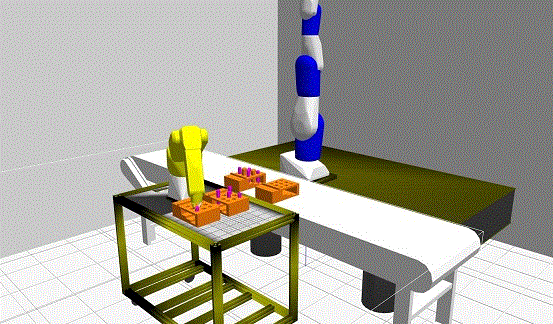
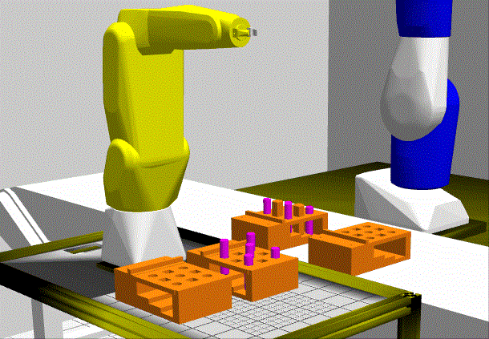
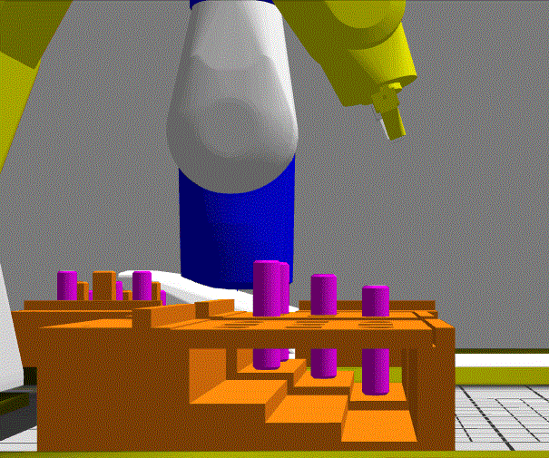



Assume clean logon. ROS1 noetic installed on Windows, and 'new' windows terminal setup. ROS1 on Windows is installed to C:\opt\ros\noetic.



# Install and Build

Assume ROS 1 noetic is installed C:\opt\ros\noetic.

	> C:\opt\ros\noetic  
	> git clone  [<u>here</u>](mailto:git@gitlab.nist.gov:michalos/gzpegboard.git)  
	> cd gzpegboard 
	> catkin_make 
	> catkin_make install 
	 



# Run



## Setup from Windows Terminal

You will need two terminals to run the code. I used Windows Terminal (google it). After starting environment variables:



	GAZEBO_MASTER_URI=http://localhost:11345 
	GAZEBO_MODEL_DATABASE_URI=http://models.gazebosim.org 
	GAZEBO_MODEL_PATH=C:\opt\ros\noetic\x64\share\gazebo-10\models; 
	GAZEBO_PLUGIN_PATH=C:\opt\ros\noetic\x64\lib\gazebo-10\plugins; 
	GAZEBO_RESOURCE_PATH=C:\opt\ros\noetic\x64\share\gazebo-10; 
	HOME=C:\Users\michalos 
	HOMEDRIVE=C: 
	HOMEPATH=\Users\michalos 



This sets up VC 2019, noetic bin and gazebo paths

Settings: 

C:\Windows\System32\cmd.exe /k "C:\Program Files (x86)\Microsoft Visual Studio\2019\Community\Common7\Tools\VsDevCmd.bat" -arch=amd64 -host_arch=amd64&& c:\opt\ros\noetic\x64\setup.bat && C:\opt\ros\noetic\x64\share\gazebo-10\setup.bat

Start two windows terminal and 



To run:

TERMINAL 1:

	> cd C:\opt\ros\noetic\gzpegboard 
	> devel\setup.bat 
	> cd bin 
	> gzpegboard.bat 



TERMINAL 2:

	> cd C:\opt\ros\noetic\gzpegboard 
	> devel\setup.bat 
	> rosrun test_gazebo_package test_gazebo_package rosbreak:=0 deadReckoning:=1 





rosbreak:=0 ignores a breakpoint in vscode

deadReckoning:=1 performs the dead reckoning peg in hole insertion.



deadReckoning:=0 performs demo of guarded move.





